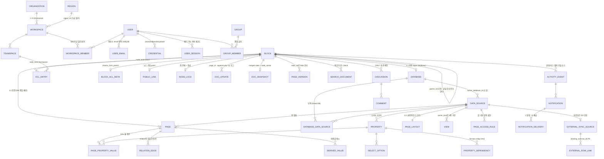

# Notion 리버스 스펙 — 마스터 통합 문서

> **작성 모드** SYNTHESIS · **작성일** 2026-09-07
> **입력** `docs/research/00-canonical-data-model.md`(스키마 정본) · `docs/research/00-feature-ownership.md`(F-ID 정본) · `docs/research/_digest/*.md`(도메인 다이제스트 17) · `docs/research/01~17-*.md`(원본 상세 2.5MB) · `docs/research/_critique/coverage-critique.md` · `docs/research/_canon/*.md`(판결문 4건)

---

## 1. 개요

### 1.1 이 문서의 목적

이 문서는 **의사결정 문서**다. "노션에 무슨 기능이 있는가"를 나열하지 않는다. 대답하는 질문은 넷이다.

| # | 질문 | 답이 있는 곳 |
|---|---|---|
| Q1 | 전체 기능은 몇 개이고 각각 누가 소유하는가 | §2 인벤토리 |
| Q2 | 되돌릴 수 없는 스키마 결정은 무엇인가 | §3 통합 데이터 모델 |
| Q3 | 무엇을 먼저 만들고 무엇을 나중에 만드는가 | §4 의존 그래프 · §5 로드맵 |
| Q4 | 무엇으로 만들고, **무엇을 만들지 않는가** | §6 스택 · §7 난제 · §8 비범위 |

### 1.2 읽는 법

- **처음 읽는다면**: §1 → §5(로드맵) → §8(안 만들 것) → §6(스택). 여기까지가 "무엇을 언제 만드나"의 전부다.
- **구현을 시작한다면**: §3 요약을 읽고 즉시 `research/00-canonical-data-model.md` 전문으로 넘어가라. **DDL은 이 문서에 복사하지 않았다.**
- **특정 기능을 만든다면**: §2에서 F-ID를 찾아 `research/NN-*.md`의 해당 `### F-` 절로 간다. 그 절이 사용자 시나리오·엣지케이스·UI 규약의 정본이다.
- **절대 하지 말 것**: 도메인 문서(01~17)의 의사 스키마를 그대로 구현하는 것. 그것들은 정본 확정 **전에** 쓰였고, 26건이 판결로 뒤집혔다.

### 1.3 조사 방법론

| 항목 | 수치 |
|---|---|
| 투입 에이전트 | **48개** (DOMAIN 17 + GAP 다회 + 비평 1 + 판결 4 + 다이제스트 17 + 통합) |
| 조사 도메인 | **17개** (01~13 초기 정의 + 14~17 커버리지 비평이 발견한 누락 도메인) |
| 웹 출처 | **300건+** (1차: notion.com/help · developers.notion.com · notion.com/blog · notion.com/releases / 2차: 오픈소스 리포지터리·엔지니어링 블로그) |
| 커버리지 비평 | **1회** — 누락 도메인 8건(A-1~A-8), 문서 간 모순 16건(C-1~C-16), 최우선 검증 10건(V-1~V-10), 부실 명세 10건(U-1~U-10) 적출 |
| 모순 판결 | **26건 요구 → 실제 31건 판결** + 클러스터 경계 모순 **14건 추가 판결(X-1~X-14)** |
| 전체 F-ID | **334개** → 중복 정리 후 **정본 278개** (포인터로 강등 56개, 중복 그룹 44개) |

**조사 원칙 3가지 (산출물 전체에 적용됨)**
1. 1차 출처 우선. 광고성 요약·"활용법" 콘텐츠는 근거로 쓰지 않는다.
2. 감상이 아니라 **동작**을 쓴다. "강력한 블록 시스템" 같은 문장은 산출물에 없다.
3. 확실하지 않으면 표시한다. 추측을 사실처럼 쓰는 것이 이 작업의 최대 실패다.

### 1.4 신뢰도 표기 규칙

이 표기는 이 문서와 하위 문서 전체에서 동일한 의미를 가진다.

| 태그 | 의미 | 취급 |
|---|---|---|
| (무표기) | 1차 출처로 확인된 사실 | 그대로 구현 근거로 사용 |
| `[판결]` / `[C-N]` `[V-N]` `[U-N]` | 판결문 4건이 문서 간 모순을 해소하며 확정 | 재판단 금지 |
| `[X-N]` | `00-canonical-data-model.md`가 클러스터 경계 모순을 해소하며 확정. **판결문을 뒤집을 수 있는 유일한 층** | 재판단 금지 |
| `[요구]` | 신규 도메인(14~17)이 요구해 정본에 흡수됨 | 구현 필요 |
| `[추정]` | 근거 없이 클론이 선택한 값·구조 | 구현하되 §9 검증 목록에 있는지 확인 |
| `[확인필요]` | 실측 미완. 잠정 결정은 있으나 뒤집힐 수 있음 | §9 참조. 착수 전 검증 |
| `[모순]` | 1차 출처끼리 충돌 | 넓은 쪽/보수적인 쪽 채택, 상수로 격리 |

### 1.5 문서 계층 — 충돌 시 이기는 순서

```
① 마스터 (이 문서)  ─ 로드맵 · 스택 · 범위 결정. 스키마를 선언하지 않는다.
        │
        ├─ ② 정본 A  research/00-canonical-data-model.md   ← 스키마의 유일한 정답지
        ├─ ② 정본 B  research/00-feature-ownership.md      ← F-ID · 난이도 · 우선순위 · MVP 경계
        │
        └─ ③ 상세    research/01~17-*.md                    ← 기능 명세(시나리오 · 엣지케이스 · UI)
                     research/_digest/*.digest.md            ← ③의 압축본(읽기 진입점)
                     research/_canon/*.md                    ← ②의 판결 근거
                     research/_critique/coverage-critique.md ← ②를 만들게 한 비평
```

**충돌 규칙**

| 충돌 | 이기는 쪽 |
|---|---|
| ③ 스키마 vs ② 정본 A | **정본 A.** 예외 없다 |
| ③ 난이도·우선순위 vs ② 정본 B | **정본 B** |
| ② 정본 A vs ② 정본 B | 이 문서가 판결한다 → **§2 각주 ※1~※3** |
| ① vs ② | ②. 단 **로드맵·스택·비범위는 ①이 유일한 권한**을 갖는다 |

**이 문서가 새로 내린 판결 3건** (정본 A·B 간 또는 정본 B 내부의 잔여 모순)

| # | 모순 | 판결 |
|---|---|---|
| ※1 | `00-feature-ownership.md` §5는 "3장에서 하향된 것은 이미 반영했다"고 선언한 뒤에도 하향된 5건을 P0 표에 그대로 싣는다 (F-07-08 / F-08-02 / F-11-07 / F-11-08 / F-13-18) | **§3의 하향 판결이 이긴다.** 다섯 건 모두 **P1**. §5 표는 "도메인 원값이 P0였던 항목의 전수 목록"으로 재해석한다. 로드맵상 위치(Phase 1)는 어차피 동일하므로 실무 영향 없음 |
| ※2 | 같은 §5가 `15-external-sync` 7건과 `17-ops-governance` 2건을 P0 목록에 넣으면서, 동시에 R3에서 "15의 P0는 전부 도메인 내 상대값이며 전역 승격하지 않았다"고 선언 | **R3이 이긴다.** 전역 우선순위는 **P2**. 표기는 `P0※`(도메인 내 P0 / 전역 P2)로 남겨 두 사실을 모두 보존 |
| ※3 | `F-11-11b`가 번호 체계(2자리)를 위반 | **`F-11-19`로 리넘버링**을 이 문서가 확정한다. 하위 문서 갱신 시 반영 |

---

## 2. 전체 기능 인벤토리 (정본 278개)

> 포인터로 강등된 56개는 이 표에 없다 → §2.19 각주 B.
> **난이도**는 R2(최고값 채택) 적용 후의 확정치다. 도메인 문서가 `S~M`처럼 범위로 적은 값은 상한을 취했다.
> **우선순위** P0 = 없으면 제품이 성립 안 함 / P1 = 없으면 경쟁력 없음 / P2 = 없어도 됨. `P0※` = §2.19 각주 A-※2.
> **MVP** 열의 ✅ 65개가 Phase 0 확정 범위다(§5).

### 2.1 01 · 블록 에디터 — [상세](research/01-block-editor.md)

| ID | 기능 | 도메인 | 난이도 | 우선 | MVP | 주요 의존 |
|---|---|---|---|---|---|---|
| F-01-01 | 블록 트리 데이터 모델 (렌더 트리 / 권한 트리 분리) | 01 | XL | P0 | ✅ | — (루트) |
| F-01-02 | 블록 타입 레지스트리 (문서화 타입 35종) | 01 | XL | P0 | ✅ 12종 | F-01-01 |
| F-01-03 | rich text 인라인 서식 (볼드/링크/컬러/코드/수식/멘션) | 01 | L | P0 | ✅ 축소 | F-01-02, F-09-03 |
| F-01-04 | 슬래시(`/`) 커맨드 메뉴 | 01 | M | P0 | ✅ | F-01-02, F-01-06 |
| F-01-05 | 마크다운 단축 입력 (블록/인라인) | 01 | M | P0 | ✅ | F-01-06 |
| F-01-06 | 블록 타입 변환 (Turn into) | 01 | M | P0 | ✅ | F-01-02 |
| F-01-07 | 중첩 (들여쓰기/내어쓰기) | 01 | M | P0 | ✅ | F-01-01 |
| F-01-08 | 드래그 재정렬 + 블록 핸들 메뉴 | 01 | L | P0 | ✅ 축소 | F-01-01, F-01-09 |
| F-01-09 | 멀티 블록 선택 및 일괄 조작 | 01 | L | P0 | ✅ 축소 | F-01-01 |
| F-01-10 | 복사/붙여넣기 구조 보존 | 01 | L | P0 | ✅ 축소 | F-01-01, F-09-03 |
| F-01-11 | Synced Block (동기화 블록) | 01 | XL | P1 | ⬜ | F-01-01, F-06-05 |
| F-01-12 | 컬럼 레이아웃 (column_list / column) | 01 | L | P1 | ⬜ | F-01-01, F-01-08 |
| F-01-13 | 접기/펼치기 컨테이너 (toggle · toggle heading · callout) | 01 | M | P0 | ✅ toggle만 | F-01-02 |
| F-01-14 | 코드 블록 | 01 | M | P0 | ⬜ P1 | F-01-02 |
| F-01-15 | 미디어·파일·북마크·임베드 블록 | 01 | XL | P0 | ✅ image만 | F-12-09, F-09-08, F-09-18 |
| F-01-16 | 자동 파생 블록 (목차 / breadcrumb / divider) | 01 | M | P1 | ⬜ | F-02-02 |
| F-01-17 | 편집 트랜잭션 · Undo/Redo · 동시편집 충돌 | 01 | XL | P0 | ✅ 로컬만 | F-01-01, F-05-01 |
| F-01-18 | 심플 테이블 (table / table_row / 셀 병합) | 01 | L | P1 | ⬜ | F-01-01 |
| F-01-19 | 캐럿 이동 · 블록 분할 · 블록 병합 | 01 | L | P0 | ✅ | F-01-03, F-01-17 |
| F-01-20 | 수식 (인라인 / 블록 equation, KaTeX) | 01 | M | P1 | ⬜ | F-01-03 |
| F-01-21 | 블록 레벨 색상 (block color / 하이라이트) | 01 | M | P1 | ⬜ 스키마만 | F-01-02 |
| F-01-22 | 대용량 페이지 렌더링 · 부분 로드 | 01 | XL | P1 | ⬜ | F-01-01, F-12-05 |

### 2.2 02 · 페이지 · 워크스페이스 — [상세](research/02-page-workspace.md)

| ID | 기능 | 도메인 | 난이도 | 우선 | MVP | 주요 의존 |
|---|---|---|---|---|---|---|
| F-02-01 | 페이지 = 블록 (page-as-block) | 02 | L | P0 | ✅ | F-01-01 |
| F-02-02 | 무한 중첩 페이지 트리 | 02 | L | P0 | ✅ | F-02-01, F-07-16 |
| F-02-05 | 페이지 아이콘 | 02 | M | P1 | ⬜ | F-02-01, F-12-09 |
| F-02-06 | 페이지 커버 이미지 | 02 | M | P2 | ⬜ | F-02-01, F-12-09 |
| F-02-07 | 페이지 레이아웃 설정 (font / small text / full width) | 02 | S | P2 | ⬜ | F-02-01, F-16-10 |
| F-02-08 | 페이지 이동 (Move to) | 02 | L | P0 | ✅ 축소 | F-02-02, F-06-20 |
| F-02-09 | 페이지 복제 (Duplicate, 딥카피) | 02 | L | P1 | ⬜ | F-02-02, F-08-01 |
| F-02-12 | Teamspace / Private / Shared 영역 구분 | 02 | XL | P0 | ⬜ P1 | F-06-04, F-14-10 |
| F-02-13 | 서브페이지 · 인라인 페이지 링크 | 02 | L | P0 | ✅ 축소 | F-02-01, F-07-08 |
| F-02-15 | Breadcrumb (경로 표시) | 02 | S | P0 | ✅ | F-02-02 |
| F-02-16 | 페이지 URL / slug / 딥링크 | 02 | M | P0 | ✅ | F-02-01, F-07-17 |
| F-02-17 | 워크스페이스 컨테이너 · 스위처 | 02 | M | P0 | ✅ | F-14-01 |
| F-02-18 | 페이지 공유 · 게스트 초대 · 웹 게시 진입 | 02 | L | P2 | ⬜ | F-06-06, F-06-08 |
| F-02-20 | 페이지 열기 모드 (full / side peek / center peek) | 02 | M | P1 | ⬜ | F-02-16, F-04-21 |
| F-02-23 | Wiki 전환 · 페이지 owner · verification | 02 | M | P2 | ⬜ | F-03-23, F-04-01 |

### 2.3 03 · 데이터베이스 코어 — [상세](research/03-database-core.md)

| ID | 기능 | 도메인 | 난이도 | 우선 | MVP | 주요 의존 |
|---|---|---|---|---|---|---|
| F-03-01 | database / data_source / page 3계층 | 03 | L | P0 | ✅ | F-01-01, F-02-01 |
| F-03-02 | 프로퍼티 스키마 관리 (추가/개명/삭제/순서) | 03 | L | P0 | ✅ | F-03-01 |
| F-03-03 | 기본 스칼라 프로퍼티군 (title/text/number/checkbox/url/email/phone) | 03 | M | P0 | ✅ 축소 | F-03-02 |
| F-03-04 | select / multi-select (옵션 레지스트리) | 03 | M | P0 | ✅ | F-03-02 |
| F-03-05 | status (옵션 + 그룹 2계층, 그룹 3 고정) | 03 | M | P1 | ⬜ | F-03-04 |
| F-03-06 | date (단일/범위/시간/타임존/리마인더) | 03 | M | P0 | ✅ 축소 | F-03-02 |
| F-03-07 | person / files & media / place | 03 | M | P0 | ⬜ P1 | F-14-01, F-12-09 |
| F-03-08 | 자동 메타 프로퍼티 4종 (created/last_edited × time/by) | 03 | M | P0 | ✅ | F-03-01, F-11-15 |
| F-03-09 | unique ID (접두사 + 자동 증가) | 03 | M | P1 | ⬜ | F-03-02 |
| F-03-10 | relation (단방향/양방향/자기참조) | 03 | L | P0 | ⬜ P1 | F-03-01, F-03-02 |
| F-03-11 | rollup (관계 경유 집계, 22함수) | 03 | L | P1 | ⬜ | F-03-10 |
| F-03-12 | formula 엔진 (Formulas 2.0) | 03 | XL | P1 | ⬜ | F-03-10, 전 타입 |
| F-03-13 | 파생 프로퍼티 의존 그래프 & 재계산 (최대 15단 DAG) | 03 | XL | P1 | ⬜ | F-03-10~12 |
| F-03-14 | 프로퍼티 타입 변환 & 데이터 마이그레이션 | 03 | L | P1 | ⬜ | F-03-02, F-03-13 |
| F-03-15 | button 프로퍼티 (행 단위 액션 트리거) | 03 | L | P2 | ⬜ | F-08-07 |
| F-03-16 | 셀 편집 UX 공통 규약 (그리드 내비/대량 붙여넣기) | 03 | L | P0 | ✅ 축소 | 전 타입, F-04-02 |
| F-03-17 | 프로퍼티별 필터·정렬 연산자 규약 (쿼리 계약) | 03 | L | P0 | ✅ | F-03-02 |
| F-03-18 | sub-item & dependency (내장 self-relation) | 03 | L | P1 | ⬜ | F-03-10, F-03-06 |
| F-03-23 | verification & Owner 자동 동반 생성 | 03 | M | P2 | ⬜ | F-03-02, F-03-07 |

### 2.4 04 · 데이터베이스 뷰 — [상세](research/04-database-views.md)

| ID | 기능 | 도메인 | 난이도 | 우선 | MVP | 주요 의존 |
|---|---|---|---|---|---|---|
| F-04-01 | 뷰 컨테이너 & 뷰 타입 전환 | 04 | M | P0 | ✅ | F-03-01, F-03-02 |
| F-04-02 | Table view | 04 | L | P0 | ✅ | F-04-01, F-04-12, F-04-15 |
| F-04-03 | Board view (Kanban) + 드래그로 값 변경 | 04 | L | P0 | ⬜ P1 | F-04-11, F-03-16 |
| F-04-04 | List view | 04 | S | P1 | ⬜ | F-04-01 |
| F-04-05 | Gallery view (카드 + 커버 소스) | 04 | M | P1 | ⬜ | F-03-07, F-12-09 |
| F-04-06 | Calendar view + date range 드래그 | 04 | L | P1 | ⬜ | F-03-06 |
| F-04-07 | Timeline view + dependency arrows | 04 | XL | P2 | ⬜ | F-04-06, F-03-18 |
| F-04-08 | Chart view (축·집계·그룹 엔진) | 04 | L | P2 | ⬜ | F-04-09, F-04-11 |
| F-04-09 | Filter (simple / advanced, AND·OR 중첩 3단) | 04 | XL | P0 | ✅ 축소 | F-03-17 |
| F-04-10 | Sort (다중 키) | 04 | M | P0 | ✅ | F-03-17, F-04-15 |
| F-04-11 | Group by / Sub-group (빈 그룹 처리) | 04 | L | P0 | ⬜ P1 | F-04-03, F-04-10 |
| F-04-12 | 뷰별 표시 프로퍼티 / 폭 / 순서 / 고정 | 04 | M | P0 | ✅ | F-03-02 |
| F-04-13 | Linked view (다른 data source 참조) | 04 | L | P1 | ⬜ | F-04-01, F-06-05 |
| F-04-14 | 인라인 DB vs 풀페이지 DB | 04 | M | P0 | ✅ | F-01-01, F-02-01 |
| F-04-15 | 페이지네이션 / load limit / 가상 스크롤 | 04 | XL | P0 | ✅ 축소 | F-04-09, F-04-10 |
| F-04-16 | 열/그룹 집계 (Calculations) | 04 | L | P1 | ⬜ | F-04-09, F-04-11 |
| F-04-17 | 개인 필터·정렬 vs "Save for everyone" | 04 | M | P2 | ⬜ | F-04-09, F-05-16 |
| F-04-19 | Map view | 04 | M | P2 | ⬜ | F-03-07(place) |
| F-04-20 | Dashboard view (위젯 컨테이너 + global filter) | 04 | L | P2 | ⬜ | F-04-13, F-04-08 |
| F-04-23 | 다중 data source 데이터베이스 | 04 | M | P0※모델 | ⬜ 모델만 | F-03-01, F-04-13 |
| F-04-24 | 뷰 결과 실시간 동기화 & 멤버십 재평가 | 04 | XL | P1 | ⬜ | F-04-09, F-05-02 |
| F-04-26 | 뷰 단위 내보내기 (Export current view) | 04 | M | P2 | ⬜ | F-09-14 |
| F-04-27 | 데이터베이스 내 검색 (뷰 툴바) | 04 | M | P1 | ⬜ | F-04-09, F-07-06 |

### 2.5 05 · 실시간 협업 · 동기화 — [상세](research/05-collaboration-sync.md)

| ID | 기능 | 도메인 | 난이도 | 우선 | MVP | 주요 의존 |
|---|---|---|---|---|---|---|
| F-05-01 | 동시 편집 병합 (충돌 해결 코어 · CRDT) | 05 | XL | P0 | ⬜ P1 | F-01-01, F-01-17 |
| F-05-02 | 실시간 전송 계층 (채널 3종 · fan-out) | 05 | L | P0 | ⬜ P1 | F-05-01, F-14-08 |
| F-05-03 | Presence (아바타 · 커서 · 편집 위치) | 05 | M | P1 | ⬜ | F-05-02 |
| F-05-04 | 낙관적 업데이트 & 로컬 트랜잭션 큐(outbox) | 05 | M | P0 | ✅ | F-01-17, F-12-16 |
| F-05-06 | 재접속 동기화 (델타 페치 · 머지) | 05 | L | P1 | ⬜ | F-05-01, F-05-02 |
| F-05-07 | 인라인 코멘트 (텍스트 범위 앵커 스레드) | 05 | L | P1 | ⬜ | F-05-08, F-05-01 |
| F-05-08 | 페이지 코멘트 · 스레드 resolve · 반응 | 05 | M | P0 | ⬜ P1 | F-06-01, F-11-08 |
| F-05-12 | 제안된 편집 (Suggested edits) | 05 | XL | P2 | ⬜ | F-05-07, F-05-01 |
| F-05-15 | 협업 Undo/Redo (origin 범위 실행취소) | 05 | L | P0 | ⬜ P1 | F-01-17, F-05-01 |
| F-05-16 | DB 실시간 동기화 (개인/공유 뷰 설정 2층) | 05 | L | P1 | ⬜ | F-04-24, F-05-02 |
| F-05-19 | 연결 인증 & 권한 변경 실시간 전파 | 05 | L | P0 | ⬜ P1 | F-06-14, F-05-02 |

**주의**: F-05-01/02는 P0이지만 MVP에서 제외했다. 대체안은 "페이지 단위 last-write-wins + 다른 사람이 편집 중 배너"이며, **`doc_update` 테이블과 채널 규약은 Phase 0에 미리 만든다**(§5.2 W3-4).

### 2.6 06 · 권한 · 공유 · 퍼블리싱 — [상세](research/06-permissions-sharing.md)

| ID | 기능 | 도메인 | 난이도 | 우선 | MVP | 주요 의존 |
|---|---|---|---|---|---|---|
| F-06-01 | 액세스 레벨 체계 (full/edit/edit_content/create/comment/view) | 06 | M | P0 | ✅ | F-14-01 |
| F-06-02 | 워크스페이스 역할 5값 + is_temporary + status | 06 | L | P0 | ✅ owner/member | F-14-10 |
| F-06-03 | 그룹(Group) 기반 권한 부여 | 06 | M | P1 | ⬜ | F-06-02, F-06-14 |
| F-06-04 | Teamspace와 가시성 (open / closed / private) | 06 | L | P1 | ⬜ | F-02-12, F-06-05 |
| F-06-05 | 페이지 권한 상속·오버라이드 (유효 권한 계산) | 06 | XL | P0 | ✅ | F-01-01, F-06-01 |
| F-06-06 | 공유 패널: 초대 · 링크 복사 · 접근 요청 진입 | 06 | M | P0 | ✅ | F-06-01, F-14-10 |
| F-06-07 | General access: 워크스페이스 전체 · 웹 링크 · 만료 | 06 | M | P0 | ✅ 축소 | F-06-06 |
| F-06-08 | 웹 게시 (Publish to Web) | 06 | XL | P1 | ⬜ | F-06-07, F-13-08 |
| F-06-09 | 게스트 관리: 한도 · 승격 · 초대 요청 | 06 | M | P1 | ⬜ | F-06-02 |
| F-06-10 | DB 세분화 권한 (edit_content / create / page_access_rule) | 06 | L | P2 | ⬜ | F-06-05, F-03-01 |
| F-06-11 | 워크스페이스 보안 정책 (유일한 deny 게이트) | 06 | M | P2 | ⬜ | F-06-02, F-17-12 |
| F-06-13 | API 연동(Connection) 권한과 capability 모델 | 06 | L | P2 | ⬜ | F-09-02, F-14-14 |
| F-06-14 | 권한 캐시 · 사이드바/검색 필터링 · 무효화 전파 | 06 | XL | P0 | ✅ 축소 | F-06-05, F-07-07 |
| F-06-15 | 접근 · 승격 요청 플로우 | 06 | M | P1 | ⬜ | F-06-06, F-11-08 |
| F-06-16 | 페이지 잠금 · 데이터베이스 잠금 (`node_lock`) | 06 | M | P1 | ⬜ | F-06-01, F-05-19 |
| F-06-19 | 조직(Organization) 계층 · 관리자 콘텐츠 거버넌스 | 06 | L | P2 | ⬜ | F-17-12, F-07-15 |
| F-06-20 | 페이지 이동과 권한 전이 | 06 | L | P0 | ✅ 축소 | F-06-05, F-02-08 |

### 2.7 07 · 검색 · 내비게이션 — [상세](research/07-search-navigation.md)

| ID | 기능 | 도메인 | 난이도 | 우선 | MVP | 주요 의존 |
|---|---|---|---|---|---|---|
| F-07-01 | 글로벌 검색 패널 (Quick Find) | 07 | L | P0 | ✅ 축소 | F-07-06, F-07-07 |
| F-07-02 | 검색 쿼리 파싱 및 결과 랭킹 | 07 | L | P0 | ⬜ | F-07-06 |
| F-07-03 | 검색 필터 (작성자·기간·위치·teamspace) | 07 | L | P1 | ⬜ | F-07-01 |
| F-07-04 | 최근 방문(Recent) · 빈 상태 내비게이션 | 07 | S | P0 | ✅ | F-07-12 |
| F-07-05 | 페이지 내 검색 (`cmd/ctrl+F`) | 07 | M | P1 | ⬜ | F-01-22 |
| F-07-06 | 검색 인덱싱 파이프라인 (block → search_document) | 07 | XL | P0 | ✅ 축소 | F-01-01, F-06-05 |
| F-07-07 | 권한 인지 검색 (permission-aware retrieval) | 07 | XL | P0 | ✅ 축소 | F-06-05, F-07-06 |
| F-07-08 | 인라인 링크 자동완성 (`@` / `[[` / `+`) | 07 | L | P1 ※1 | ⬜ | F-07-06, F-01-03 |
| F-07-09 | 백링크 · 링크 그래프 | 07 | M | P1 | ⬜ | F-07-08, F-06-05 |
| F-07-11 | 커맨드 팔레트 / 액션 실행 (Command Search) | 07 | L | P2 | ⬜ | F-07-01, F-12-11 |
| F-07-12 | 페이지 간 이동 · 히스토리 · 탭 | 07 | M | P0 | ✅ 축소 | F-02-16 |
| F-07-15 | 관리자 콘텐츠 검색 (Admin Content Search) | 07 | L | P2 | ⬜ | F-06-19, F-07-06 |
| F-07-16 | 사이드바 트리 내비게이션 · 즐겨찾기 | 07 | L | P0 | ✅ | F-02-02, F-06-14 |
| F-07-17 | URL · breadcrumb · 블록 앵커 딥링크 | 07 | M | P0 | ✅ 축소 | F-02-16, F-02-15 |
| F-07-19 | `Home` · `Library` 브라우징 표면 | 07 | M | P1 | ⬜ | F-07-04, F-07-16 |

### 2.8 08 · 템플릿 · 자동화 · 버튼 — [상세](research/08-templates-automation.md)

| ID | 기능 | 도메인 | 난이도 | 우선 | MVP | 주요 의존 |
|---|---|---|---|---|---|---|
| F-08-01 | 페이지 템플릿 (블록 서브트리 깊은 복사 엔진) | 08 | L | P0 | ⬜ | F-01-01, F-02-09 |
| F-08-02 | 데이터베이스 템플릿 (새 항목 기본값) | 08 | M | P1 ※1 | ⬜ | F-08-01, F-03-01 |
| F-08-03 | 기본 템플릿 지정 (뷰별 / DB 전체) | 08 | S | P1 | ⬜ | F-08-02, F-04-01 |
| F-08-04 | 반복 템플릿 (Recurring) | 08 | L | P2 | ⬜ | F-08-02, 공용 스케줄러 |
| F-08-05 | 템플릿 갤러리 / 마켓플레이스 | 08 | XL | P2 | ❌ | §8-06 |
| F-08-06 | 버튼 블록 (`/button`) | 08 | M | P1 | ⬜ | F-08-07, F-01-04 |
| F-08-07 | 액션 실행 엔진 (공식 액션 11종) | 08 | XL | P1 | ⬜ | F-06-05, F-03-16 |
| F-08-09 | DB automation 트리거 (page_added / property_edited / schedule) | 08 | XL | P1 | ⬜ | F-08-07, outbox |
| F-08-10 | 자동화 실행 런타임 (연쇄·루프 차단·실행 주체) | 08 | L | P1 | ⬜ | F-08-07, F-08-09 |
| F-08-11 | 변수 정의 + mention/formula 결합 (값 슬롯) | 08 | M | P2 | ⬜ 스키마 | F-03-12, F-08-07 |
| F-08-13 | 외부 연동 액션 (webhook / Gmail / Slack) | 08 | L | P2 | ⬜ webhook만 | F-08-07, F-09-09 |
| F-08-14 | 공개 API에서의 템플릿·버튼 취급 | 08 | S | P2 | ⬜ | F-09-01 |
| F-08-18 | Notion Workers (호스팅 코드 실행) — **클론 비권장** | 08 | XL | P2 | ❌ | §8-04 |

### 2.9 09 · 공개 API · 임베드 · 임포트/익스포트 — [상세](research/09-api-integrations.md)

| ID | 기능 | 도메인 | 난이도 | 우선 | MVP | 주요 의존 |
|---|---|---|---|---|---|---|
| F-09-01 | 공개 REST API 리소스 표면 (엔드포인트 계약) | 09 | XL | P1 | ⬜ | F-09-02, F-09-04 |
| F-09-02 | 인증 & 권한 (토큰 3종 × capability × 페이지 공유) | 09 | XL | P1 | ⬜ | F-06-13, F-14-14 |
| F-09-03 | Rich text JSON 스키마 (텍스트 직렬화 계약) | 09 | M | P0 | ✅ | F-01-03 |
| F-09-04 | 커서 페이지네이션 | 09 | S | P0 | ✅ | `order_key` |
| F-09-05 | Rate limit · 크기 제한 · 에러 규약 · 버저닝 | 09 | M | P1 | ⬜ | F-09-02 |
| F-09-06 | Search 엔드포인트 | 09 | L | P1 | ⬜ | F-07-06, F-09-02 |
| F-09-07 | Comments API | 09 | L | P2 | ⬜ | F-05-08 |
| F-09-08 | 파일 업로드 API & 서명 URL 만료(1시간) | 09 | M | P0 | ✅ | F-12-09 |
| F-09-09 | Webhook 구독 (verification token + HMAC) | 09 | L | P2 | ⬜ | `activity_event`, outbox |
| F-09-10 | Embed 블록 (외부 iframe 삽입) | 09 | M | P1 ※4 | ⬜ | F-09-18, F-01-15 |
| F-09-11 | Bookmark · Link mention · Link Preview (언퍼링 3종) | 09 | XL | P1 | ⬜ 전2종 | F-09-18 |
| F-09-12 | 임포트: 파일 기반 (MD/HTML/CSV/DOCX/TXT/ZIP) | 09 | L | P1 | ⬜ | F-09-22, 잡 큐 |
| F-09-13 | 임포트: 서드파티 앱 (Evernote/Trello/Confluence 등) | 09 | XL | P2 | ❌ | §8-12 |
| F-09-14 | 익스포트 (Markdown&CSV / HTML / PDF) | 09 | XL | P0 | ⬜ | F-09-22, F-06-05 |
| F-09-15 | 공식 SDK · 개발자 온보딩 표면 | 09 | M | P2 | ⬜ | F-09-01 |
| F-09-16 | Data source query (필터·정렬 DSL, 10,000행 상한) | 09 | XL | P1 | ⬜ | F-03-17, F-04-09 |
| F-09-17 | Page property value 스키마 & property item 엔드포인트 | 09 | XL | P1 | ⬜ | F-03-13 |
| F-09-18 | oEmbed 언퍼 프로토콜 계약 | 09 | L | P1 | ⬜ | SSRF 방어 인프라 |
| F-09-19 | Notion MCP 서버 (LLM 에이전트 도구 표면) | 09 | L | P2 | ⬜ | F-09-02, F-09-22 |
| F-09-20 | Admin API (Enterprise 조직 관리) | 09 | L | P2 | ❌ | §8-14 |
| F-09-22 | Markdown API (Notion-flavored MD 읽기/쓰기) | 09 | L | P1 | ⬜ | F-09-03 |
| F-09-23 | Notion Workers · CLI (호스팅형 통합 런타임) | 09 | XL | P2 | ❌ | §8-04 |

### 2.10 10 · AI — [상세](research/10-ai-features.md)

| ID | 기능 | 도메인 | 난이도 | 우선 | MVP | 주요 의존 |
|---|---|---|---|---|---|---|
| F-10-01 | 인라인 AI 작성 (Ask AI / 빈 줄 프롬프트) | 10 | L | P0 | ⬜ | F-10-09, F-01-04 |
| F-10-02 | 선택 영역 AI 편집 프리셋 (요약·톤·길이·문법) | 10 | M | P0 | ⬜ | F-10-01 |
| F-10-03 | 페이지 전체 번역 | 10 | M | P1 | ⬜ | F-10-02 |
| F-10-04 | AI 블록 (Summary / Action items / Custom) | 10 | M | P1 | ⬜ | F-01-02, F-10-01 |
| F-10-05 | AI 데이터베이스 프로퍼티 (Autofill) | 10 | L | P2 | ⬜ | F-03-02, F-10-12 |
| F-10-06 | AI Q&A (워크스페이스 검색 기반 답변) | 10 | XL | P1 | ⬜ | F-10-08, F-07-07 |
| F-10-07 | AI 커넥터 (Slack / Google Drive 등) | 10 | XL | P2 | ❌ | §8-13 |
| F-10-08 | 권한 인지 임베딩 인덱스 파이프라인 | 10 | XL | P1 | ⬜ | F-07-06, F-06-14 |
| F-10-09 | 스트리밍 응답 및 생성 라이프사이클 | 10 | L | P0 | ⬜ | — (AI 루트) |
| F-10-10 | Research Mode (멀티스텝 조사 + 보고서) | 10 | XL | P2 | ⬜ | F-10-06, F-10-20 |
| F-10-11 | AI Meeting Notes (녹음 → 전사 → 요약) | 10 | XL | P2 | ❌ | §8-10 |
| F-10-12 | 요금 · 사용 한도 · 크레딧 (AI 거버넌스) | 10 | L | P0 | ⬜ | F-13-18 |
| F-10-13 | Custom Agents (트리거 기반 자율 실행) | 10 | XL | P2 | ❌ | §8-05 |
| F-10-14 | 이미지 생성 및 편집 | 10 | S | P2 | ⬜ | F-12-09 |
| F-10-15 | Build with AI (프롬프트로 DB·뷰·페이지 구축) | 10 | L | P2 | ⬜ | F-03-02, F-04-01 |
| F-10-16 | 파일·이미지 입력 분석 및 산출물 파일 생성 | 10 | XL | P1 | ⬜ 입력만 | F-12-09, F-10-09 |
| F-10-17 | AI 채팅 표면 (세션·히스토리·소스 범위) | 10 | M | P1 | ⬜ | F-10-09, F-10-06 |
| F-10-19 | Notion Skills (재사용 워크플로 지시문) | 10 | S | P2 | ⬜ | `page.is_skill` |
| F-10-20 | 에이전트 세션 API + 휴먼 승인 게이트 (HITL) | 10 | L | P2 | ⬜ 스키마 | F-10-09 |
| F-10-21 | Notion Agent (개인 에이전트 · 사용자 권한 위임) | 10 | XL | P2 | ❌ | §8-05 |
| F-10-22 | Agent Instructions 페이지 (개인화 메모리) | 10 | S | P1 | ⬜ | F-10-17 |
| F-10-23 | External Agents (Claude·Cursor를 팀메이트로) | 10 | XL | P2 | ❌ | §8-05 |
| F-10-24 | AI 생성 인터랙티브 HTML 블록 | 10 | L | P2 | ❌ | §8-11 |
| F-10-25 | AI 사용량 분석 · 에이전트 감사 로그 | 10 | M | P1 | ⬜ | F-10-12, F-11-12 |
| F-10-26 | 모델 선택 및 Auto 라우팅 | 10 | M | P1 | ⬜ 스키마 | F-10-09, F-10-12 |

### 2.11 11 · 히스토리 · 알림 · 활동 — [상세](research/11-history-notifications.md)

| ID | 기능 | 도메인 | 난이도 | 우선 | MVP | 주요 의존 |
|---|---|---|---|---|---|---|
| F-11-01 | 페이지 버전 히스토리 (스냅샷 기록·조회) | 11 | L | P1 | ⬜ | F-05-01, `doc_update` |
| F-11-02 | 버전 복원 (Restore, 비파괴적) | 11 | M | P1 | ⬜ | F-11-01 |
| F-11-03 | 버전 보관 기간 정책 & 히스토리 GC | 11 | M | P2 | ⬜ | F-11-01, F-13-18 |
| F-11-04 | 페이지 활동 피드 (Updates & analytics) | 11 | L | P2 | ⬜ | `activity_event` |
| F-11-05 | 휴지통 (Trash) — 삭제 · 조회 · 복원 | 11 | M | P0 | ✅ | F-02-02, `block.lifecycle` |
| F-11-06 | 영구 삭제 & 커스텀 데이터 보존 정책 | 11 | M | P2 | ⬜ | F-11-05 |
| F-11-07 | 인박스 (Inbox) — 알림 목록·필터·읽음/보관 | 11 | M | P1 ※1 | ⬜ | F-11-08 |
| F-11-08 | 알림 생성 규칙 엔진 (멘션·답글·할당·초대) | 11 | L | P1 ※1 | ⬜ | F-05-08, F-07-08 |
| F-11-09 | 페이지 구독(Follow) & 페이지별 알림 레벨 | 11 | M | P1 | ⬜ | F-11-08 |
| F-11-10 | 리마인더 (`@remind` · Date property) | 11 | M | P2 | ⬜ | F-03-06, 공용 스케줄러 |
| F-11-11 | 알림 채널 팬아웃 (인앱·데스크톱·모바일·이메일·Slack) | 11 | XL | P1 | ⬜ 인앱+메일 | F-11-08, F-05-03 |
| F-11-19 ※3 | Slack 채널 연동 (페이지 → Slack 브로드캐스트) | 11 | M | P2 | ⬜ | F-11-11 |
| F-11-12 | 워크스페이스 감사 로그 & SIEM 스트리밍 | 11 | XL | P2 | ⬜ 10종만 | §8-19 |
| F-11-15 | 블록 단위 편집 이력 (`created_by` / `last_edited_by`) | 11 | S | P1 | ⬜ 스키마 ▲ | F-01-01 |
| F-11-18 | 활동·알림 데이터 수명 & 조회 기록 프라이버시 | 11 | M | P1 | ⬜ 스키마 | F-11-04, F-17-03 |

▲ F-11-15는 MVP 65개에 들어가지 않지만 **컬럼 4개는 W2에 반드시 심는다**(§3.3-15). 과거 편집자는 **백필이 불가능한 유일한 데이터**다.

### 2.12 12 · 플랫폼 · UX · 성능 — [상세](research/12-platform-ux.md)

| ID | 기능 | 도메인 | 난이도 | 우선 | MVP | 주요 의존 |
|---|---|---|---|---|---|---|
| F-12-01 | 키보드 단축키 체계 (전역·편집·블록선택) | 12 | L | P0 | ✅ 최소셋 | F-01-02, F-01-09 |
| F-12-03 | 테마 시스템 (라이트/다크/시스템 + 고대비) | 12 | M | P1 | ⬜ | F-01-21(색 토큰) |
| F-12-04 | 오프라인 모드 (다운로드·로컬편집·재동기화) | 12 | XL | P2 | ⬜ | F-12-05, F-05-01 |
| F-12-05 | 클라이언트 로컬 캐시 (WASM SQLite + OPFS) | 12 | XL | P2 | ⬜ | 정규화 레코드 모델 |
| F-12-07 | 초기 로딩 성능 (번들 · 요청 워터폴 · `/bootstrap`) | 12 | M | P1 | ⬜ | F-07-16 |
| F-12-09 | 이미지·파일 업로드와 스토리지 | 12 | L | P0 | ✅ 축소 | F-09-08 |
| F-12-10 | 웹 클리퍼 (브라우저 확장 · 공유 시트) | 12 | L | P2 | ⬜ | F-09-12(HTML→block) |
| F-12-11 | 데스크톱 앱 (Electron / Tauri) 고유 기능 | 12 | L | P2 | ❌ | §8-18 |
| F-12-12 | 모바일 앱과 데스크톱의 동작 차이 | 12 | L | P1 | ⬜ 반응형웹 | F-12-11 |
| F-12-13 | 접근성 (a11y) | 12 | XL ▲ | P1 | ⬜ 구조결정 | F-01-01(단일 contenteditable) |
| F-12-14 | 지역화(i18n) · 시간대 · 날짜 형식 | 12 | L | P2 | ⬜ ko/en | F-03-06 |
| F-12-15 | 플랫폼 지원 매트릭스 (`isAvailable()` 게이팅) | 12 | S | P1 | ⬜ | F-12-17 |
| F-12-16 | 오류 · 복구 UX (단절 · 저장실패 · 로컬 리셋) | 12 | L | P0 | ✅ 축소 | F-05-04 |
| F-12-17 | 배포 · 자동 업데이트 · 버전 스큐 | 12 | L | P1 | ⬜ | `unknown_fields` 규약 |
| F-12-18 | 성능 계측 (RUM · 회귀 방지) | 12 | M | P1 | ⬜ 훅만 | — |
| F-12-19 | 서버 측 성능 기반 (Postgres 수평 샤딩·재샤딩) | 12 | XL | P2 | ❌ | §8-09 |

▲ F-12-13은 **초기 설계에 반영하면 M, 사후 개선이면 XL**이다. R2(최고값 채택)에 따라 XL로 표기하되, 실제 비용은 §5.2 W3-4의 "단일 `contenteditable` 채택" 결정 하나로 M에 가깝게 떨어진다.

### 2.13 13 · 인접 제품군 — [상세](research/13-adjacent-products.md)

| ID | 기능 | 도메인 | 난이도 | 우선 | MVP | 주요 의존 |
|---|---|---|---|---|---|---|
| F-13-01 | Notion Forms — 폼 생성 & 질문↔프로퍼티 바인딩 | 13 | L | P2 | ⬜ | F-04-01, F-06-07 |
| F-13-02 | Forms — 공개 제출 파이프라인 (익명·사후권한·알림) | 13 | L | P2 | ⬜ | F-13-01, F-17-10 |
| F-13-03 | Forms — 조건부 로직 (question branching) | 13 | M | P2 | ⬜ | F-13-01 |
| F-13-04 | Notion Calendar — 독립 앱 + 외부 계정 연결 | 13 | XL | P2 | ❌ | §8-02 |
| F-13-05 | Calendar ↔ Notion DB 양방향 연동 | 13 | L | P1 | ⬜ | F-04-06, F-03-06 |
| F-13-06 | Scheduling links / availability (예약 링크) | 13 | L | P2 | ❌ | §8-03 |
| F-13-07 | Notion Mail — 뷰 기반 인박스 | 13 | XL | P2 | ❌ | §8-01 (원본 종료) |
| F-13-08 | Notion Sites — 페이지 웹 퍼블리싱 제품화 | 13 | L | P1 | ⬜ | F-06-08 |
| F-13-09 | Sites — 커스텀 도메인 · DNS 검증 · SEO · Analytics | 13 | L | P2 | ⬜ 위임 | F-13-08, F-17-11 |
| F-13-16 | 커스텀 이모지 (워크스페이스 이모지 라이브러리) | 13 | M | P1 | ⬜ | F-01-03, F-12-09 |
| F-13-18 | 요금제 엔타이틀먼트 엔진 (Free/Plus/Business/Enterprise) | 13 | L | P1 ※1 | ⬜ | 전 도메인 |

### 2.14 14 · 계정 · 인증 · 세션 — [상세](research/14-auth-accounts.md)

| ID | 기능 | 도메인 | 난이도 | 우선 | MVP | 주요 의존 |
|---|---|---|---|---|---|---|
| F-14-01 | 계정 생성 (이메일 · Google · Apple · Microsoft) | 14 | M | P0 | ✅ 메일+구글 | F-14-02 |
| F-14-02 | 이메일 로그인 코드(OTP) 발급·검증 | 14 | S | P0 | ✅ | 메일 인프라 |
| F-14-03 | 비밀번호 설정·변경·**제거**·재설정 | 14 | S | P1 | ⬜ | F-14-08 |
| F-14-04 | Passkey (WebAuthn) 등록·로그인·삭제 | 14 | M | P2 | ⬜ 스키마 | F-14-01 |
| F-14-05 | 2단계 인증 (TOTP · SMS · 백업코드) | 14 | M | P1 | ⬜ | F-14-03 |
| F-14-06 | 소셜 로그인 결합 · 계정 병합 규칙 | 14 | M | P1 | ⬜ | F-14-07 |
| F-14-07 | 계정당 이메일 최대 5개 (별칭 로그인·공유·멘션) | 14 | M | P0 | ✅ 스키마 | F-14-01 |
| F-14-08 | 세션 · 디바이스 관리 · 전체 로그아웃 · 신규 로그인 알림 | 14 | M | P1 ▲ | ✅ 축소 | F-14-01~06 |
| F-14-09 | 다중 계정 전환 + 워크스페이스 전환 | 14 | M | P0 | ⬜ | F-14-08, F-02-17 |
| F-14-10 | 워크스페이스 초대·수락·자동 가입 (4경로) | 14 | L | P0 | ✅ 메일초대 | F-14-07, F-06-02 |
| F-14-11 | SAML SSO 강제와 예외 (게스트·owner 백도어) | 14 | L | P2 | ⬜ 스키마 | F-14-08 |
| F-14-12 | SCIM 프로비저닝 · managed user | 14 | XL | P2 | ❌ | §8-07 |
| F-14-13 | 계정 삭제와 데이터 처리 (워크스페이스 연쇄 파괴) | 14 | L | P1 | ⬜ | F-14-08, F-02-17 |
| F-14-14 | bot / integration user와 person user의 구분 | 14 | S | P0 | ✅ 스키마 | F-14-01 |
| F-14-15 | 프로필 · 이메일 변경 · 계정 프라이버시 설정 | 14 | S | P1 | ⬜ | F-14-07 |
| F-14-16 | 인증 남용 방어 (레이트리밋·계정 열거 방지·이상 로그인) | 14 | M | P0 | ✅ 축소 | F-14-02 |

▲ F-14-08은 도메인 문서가 "디바이스 목록 UI" 기준으로 P1을 매겼으나, **세션 코어(발급·만료·로그아웃)는 P0**이다. 정본 B가 유일한 "P1 → MVP 역편입"으로 확정했다.

### 2.15 15 · 외부 시스템 동기화 (Synced Databases) — [상세](research/15-external-sync.md)

| ID | 기능 | 도메인 | 난이도 | 우선 | MVP | 주요 의존 |
|---|---|---|---|---|---|---|
| F-15-01 | Synced DB 컨테이너 · 바인딩 · 생성 플로우 | 15 | L | P0※ | ⬜ | F-03-01, F-15-02 |
| F-15-02 | 커넥터 인증 (사용자 토큰 vs 관리자 토큰) | 15 | L | P0※ | ⬜ | F-06-13 |
| F-15-03 | 외부 스키마 → 프로퍼티 매핑 · 제외 규칙 | 15 | L | P0※ | ⬜ | F-03-02, F-15-01 |
| F-15-04 | `external_id` ↔ `page_id` 매핑과 멱등 upsert | 15 | M | P0※ | ⬜ 코어 | F-15-01, F-15-03 |
| F-15-05 | 증분 동기화 엔진 (백필·webhook·조회 트리거·재조정) | 15 | XL | P0※ | ⬜ | F-15-04, 스케줄러 |
| F-15-06 | 외부 origin 행의 readonly × local 프로퍼티 공존 | 15 | M | P1 | ⬜ 축만 | `property.writable` |
| F-15-07 | Identity mapping (외부 계정 ↔ 노션 user) | 15 | M | P1 | ⬜ | F-14-07 |
| F-15-08 | 소스 삭제 전파 · "복원 불가 휴지통" | 15 | S | P0※ | ⬜ | F-11-05, `trash_reason` |
| F-15-09 | 소스 구성 변경 대응 (키 rename · URL 변경 · 범위) | 15 | M | P1 | ⬜ | F-15-05 |
| F-15-10 | 양방향 write-back (Enterprise · 5필드) | 15 | XL | P2 | ❌ | §8-15 |
| F-15-11 | 동기화 상태 표면 (배지 · 오류 코드 · 재인증) | 15 | S | P0※ | ⬜ 필수 | F-15-05 |
| F-15-12 | 외부 relation 재구성 (크로스 프로젝트 · magic word) | 15 | L | P1 | ⬜ | F-03-10, F-15-04 |
| F-15-14 | 동기화 충돌 처리 (원격 × 로컬 × write-back 경합) | 15 | M | P1 | ⬜ | F-15-06, F-15-10 |
| F-15-15 | 연결 해제 · detach · 데이터 잔존 수명주기 | 15 | M | P1 | ⬜ | F-15-02, F-11-05 |

### 2.16 16 · 데이터베이스 항목 페이지 레이아웃 — [상세](research/16-item-layout.md)

| ID | 기능 | 도메인 | 난이도 | 우선 | MVP | 주요 의존 |
|---|---|---|---|---|---|---|
| F-16-01 | 레이아웃 편집 모드 진입 & 적용 스코프 | 16 | M | P1 | ⬜ | F-04-01, F-03-02 |
| F-16-02 | Heading 모듈 & pinned 프로퍼티 (최대 15) | 16 | M | P1 | ⬜ | F-16-01, F-16-03 |
| F-16-03 | Property group & 섹션 (잔여 계산 컨테이너) | 16 | M | P0 | ⬜ | F-16-01, F-03-02 |
| F-16-04 | 개별 프로퍼티 모듈 승격 & 배치 이동 | 16 | M | P2 | ⬜ | F-16-03, F-16-05 |
| F-16-05 | 상세 패널 (Details panel) | 16 | M | P2 | ⬜ | F-16-04 |
| F-16-06 | 구조 전환 Simple ↔ Tabbed | 16 | S | P2 | ⬜ | F-16-07, F-16-08 |
| F-16-07 | Content 탭 — 본문 블록 트리와 모듈의 소유자 분리 | 16 | S | P0 | ⬜ 규약만 | F-01-01, F-02-01 |
| F-16-08 | 관련 DB 탭 — 지속 linked view + `current_page` 자동 필터 | 16 | L | P2 | ⬜ `owner_kind`만 | F-03-17, F-04-13 |
| F-16-09 | Backlinks 표시 모드 (Always / Hover / Off) | 16 | S | P2 | ⬜ | F-07-09 |
| F-16-10 | Page settings 4종 (코멘트 표시 / 토론 / 아이콘 / 전체폭) | 16 | S | P2 | ⬜ | F-02-07 |
| F-16-12 | 영속화 · 동시편집(낙관적 잠금) · 감사 · 마이그레이션 | 16 | M | P1 | ⬜ | F-16-01~10 |

### 2.17 17 · 운영 · 거버넌스 — [상세](research/17-ops-governance.md)

| ID | 기능 | 도메인 | 난이도 | 우선 | MVP | 주요 의존 |
|---|---|---|---|---|---|---|
| F-17-01 | 워크스페이스 분석 대시보드 (4탭 + 탭별 접근 제어) | 17 | L | P2 | ⬜ Content탭 | F-17-02, F-17-03 |
| F-17-02 | 분석 수집·롤업 파이프라인 & 지표 정의 | 17 | L | P2 | ⬜ 훅만 | F-11-18 |
| F-17-03 | 분석 옵트아웃 3계층 (AND 게이트) | 17 | M | P1 | ⬜ 게이트만 | F-17-02, F-17-12 |
| F-17-04 | 검색 분석 & 검색 품질 피드백 루프 | 17 | M | P2 | ⬜ 로그만 | F-07-02, F-17-02 |
| F-17-05 | 워크스페이스 리전 배정 & 리전 인지 라우팅 | 17 | XL | P0※ | ⬜ 컬럼만 | `workspace.region_id` |
| F-17-06 | 리전 경계 제약 레지스트리 | 17 | L | P0※ | ⬜ 리졸버만 | F-17-05 |
| F-17-07 | 조직 기본 리전 지정 & 리전 마이그레이션 | 17 | XL | P2 | ❌ | §8-08 |
| F-17-08 | 공개 페이지 남용 신고 (Report page) | 17 | S | P1 | ⬜ | F-06-08 |
| F-17-09 | 모더레이션 큐 · 테이크다운 · 자동 스캔 · DMCA | 17 | L | P1 | ⬜ 조치경로 | F-17-08 |
| F-17-10 | 공개 쓰기 경로 남용 방어 (토큰·허니팟·레이트리밋·캡차) | 17 | M | P1 | ⬜ | F-13-02 |
| F-17-11 | 크롤러 · 색인 제어 (robots / noindex / AI 크롤러 2축) | 17 | M | P1 | ⬜ 기본noindex | F-06-08 |
| F-17-12 | 설정 정보구조 레지스트리 (device/account/workspace/org) | 17 | M | P0 | ⬜ | F-06-02, F-13-18 |
| F-17-13 | 조직 설정 잠금(Bulk apply) & 커스텀 관리자 역할 | 17 | L | P2 | ❌ | §8-16 |

### 2.18 집계

| 구분 | 수 |
|---|---|
| 전체 F-ID (17개 문서) | 334 |
| **정본 F-ID** | **278** |
| 포인터로 강등 | 56 (중복 그룹 44) |
| 정본 중 P0 | 102 (그중 전역 P0 실질 91, `P0※` 9 + ※1 하향 5 반영 시 88) |
| **Phase 0(MVP) 확정** | **65** |
| Phase 1 이월 | 29 (P0) + 선별 P1 |
| 의도적 비구현(❌) | 20 → §8 |

### 2.19 각주

**각주 A — 우선순위 표기**

| 마커 | 의미 |
|---|---|
| `※1` | 정본 B §3의 하향 판결과 §5 P0 표가 충돌한 5건. **하향 판결이 이긴다**(§1.5 ※1). 해당: F-07-08 · F-08-02 · F-11-07 · F-11-08 · F-13-18 |
| `※2` (`P0※`) | 도메인 내부 상대 P0이며 **전역 우선순위는 P2**. 해당: F-15-01/02/03/04/05/08/11 · F-17-05/06 |
| `※3` | `F-11-11b` → **`F-11-19`로 리넘버링 확정**(§1.5 ※3) |
| `※4` | F-09-10 Embed는 13번 문서가 P0(`F-13-17`)로 주장했으나, R3("없으면 제품이 성립하는가") 적용 시 **P1**. 다만 난이도 S~M으로 ROI가 매우 높아 Phase 2 최우선 후보 |
| `❌` | 이 프로젝트에서 **만들지 않기로 확정**. 근거는 §8 해당 번호 |

**각주 B — 포인터(중복)로 강등된 56개 F-ID → 정본 매핑**

같은 기능이 여러 도메인에서 중복 명세된 결과다. 원 위치에는 "정본: F-XX-YY 참조" 한 줄만 남긴다.

| 포인터 | → 정본 | 포인터 | → 정본 |
|---|---|---|---|
| F-02-03, F-02-04 | F-07-16 | F-08-08 | F-03-15 |
| F-02-10, F-04-25, F-05-11 | F-06-16 | F-08-12, F-07-10 | F-01-04 |
| F-02-11 | F-11-05 | F-08-15, F-03-20 | F-10-05 |
| F-02-14 | F-07-09 | F-08-16, F-13-15, F-06-18 | F-10-13 |
| F-02-19, F-05-13 | F-11-01 | F-08-17, F-05-18, F-11-13 | F-09-09 |
| F-02-21, F-12-02 | F-07-01 | F-09-21 | F-08-13 |
| F-02-22 | F-09-14 | F-10-18, F-07-18(부분) | F-09-19 |
| F-03-19, F-11-17 | F-08-09 | F-11-14 | F-05-15 |
| F-03-21, F-04-28 | F-08-02 | F-11-16 | F-05-12 |
| F-03-22 | F-06-10 | F-12-06, F-05-14 | F-01-22 |
| F-04-18 | F-13-01 / F-13-02 | F-12-08 | F-04-15 |
| F-04-21, F-16-11 | F-02-20 | F-13-10 | F-04-08 |
| F-04-22 | F-03-18 | F-13-11 | F-04-20 |
| F-05-05 | F-12-04 | F-13-12 | F-02-23 |
| F-05-09 | F-07-08 | F-13-13 | F-03-23 |
| F-05-10 | F-11-07 | F-13-14 | F-10-21 |
| F-05-20 | F-12-05 | F-13-17 | F-09-10 |
| F-06-12 | F-14-12 | F-06-17 | F-13-02 |
| F-07-13 | F-10-06 | F-07-14 | F-04-27 |
| F-15-13 | F-13-18 | F-07-18 | F-09-06 |

**각주 C — 중복이 아닌 인접 쌍** (오판 방지)

`F-06-14`(권한 캐시) vs `F-07-07`(권한 인지 검색) — 층이 다르다 · `F-04-06`(Calendar 뷰) vs `F-13-04/05`(Calendar 앱) · `F-03-06`(date 값) vs `F-11-10`(리마인더 스케줄러) · `F-02-05`(아이콘) vs `F-13-16`(이모지 라이브러리) · `F-02-16`(페이지 URL) vs `F-07-17`(블록 앵커) · `F-02-08`(이동 조작) vs `F-06-20`(이동 시 ACL) · `F-09-09`(구독형 웹훅) vs `F-08-13`(자동화 액션 웹훅) · `F-01-15`(미디어 블록) vs `F-09-08`(업로드 API) vs `F-12-09`(스토리지) — 3층 분리 · `F-13-18`(요금제) vs `F-10-12`(AI 크레딧) vs `F-15-13`(커넥션 게이팅) — 후자 둘은 소비자

---

## 3. 통합 데이터 모델 (요약)

> **DDL은 여기에 없다.** 테이블·컬럼·인덱스·불변식의 정본은 [`research/00-canonical-data-model.md`](research/00-canonical-data-model.md)이며, 이 절은 **아키텍처를 결정하는 판결만** 옮긴다. 구현 시 반드시 정본을 열어라.
> 엔티티 총수 약 90개. 소유 클러스터: **BT** 블록트리 · **DB** 데이터베이스 · **PM** 권한 · **SV** 동기화/버전 · **AU** 인증 · **XS** 외부동기화 · **IL** 항목레이아웃 · **OG** 운영거버넌스.

### 3.1 핵심 엔티티 관계도



**읽는 법 2가지**

1. `block`이 유일한 콘텐츠 테이블이다. **페이지도 블록이고(`type='page'`), 데이터베이스 행도 블록이다**(`type='page' AND parent_type='data_source'`). `page` / `database`는 `block`의 1:1 확장이지 별도 계층이 아니다 `[X-2]`.
2. 권한은 `block.parent_id` 상향 체인 하나로만 흐른다. `content uuid[]`(하향 배열)은 **존재하지 않는다** — 자식 목록은 `parent_id` 인덱스로 재구성하고 순서는 `order_key`가 준다 `[C-10]`.

### 3.2 아키텍처를 결정하는 판결 5건

이 다섯 개가 나머지 전부를 규정한다. 나머지는 여기서 파생된다.

---

#### (1) 블록 트리 저장 방식과 형제 순서 — `order_key` fractional index, 단 **정본은 부모 종류에 따라 갈린다** `[C-10 + X-1]`

| 채택 | 폐기 |
|---|---|
| 인접 리스트(`parent_id`) + `order_key text` fractional index. `UNIQUE(parent_id, order_key)`, 정렬은 `ORDER BY order_key, id`, `collate("C")` | `content uuid[]` 배열 저장 · 정수 `position` · `order_idx`(형제 순서 용도) · `block.path text` materialized path |

**왜 배열을 버렸는가** — 자식 순서를 부모 행의 배열에 담으면 부모 행이 **페이지 전체 편집의 직렬화 지점**이 된다. 두 사람이 서로 다른 위치에 블록을 삽입해도 같은 행을 놓고 경합한다. fractional index는 삽입·이동 시 **1행만** 갱신한다.

**X-1: 그런데 CRDT를 채택한 이상 순서가 두 곳에 있다.** y-prosemirror를 쓰면 페이지 본문의 블록 시퀀스는 `Y.XmlFragment`의 내재적 순서로 이미 표현된다. `order_key`와 이중 진실이 된다. 판결은 **입도로 축을 자르는 것**이다.

| `block.parent_type` | 형제 순서의 정본 | `order_key`의 지위 |
|---|---|---|
| `'block'` (부모가 페이지 또는 컨테이너 블록) | **Y.Doc** | **파생.** 프로젝터가 계산해 쓰는 읽기 모델 |
| `'data_source'` (DB 행) | **RDB** | **정본.** 어떤 Y.Doc도 행 목록을 담지 않는다 |
| `'teamspace'` / `'workspace'` (사이드바 최상위) | **RDB** | **정본** |

**대가와 SLO** — `block` 테이블은 페이지 본문에 대해 **결과적 일관성**을 갖는다. `doc_snapshot.projected_seq < merged_seq`인 창 동안 검색·공개 API·사이드바는 낡은 값을 본다. 에디터는 Y.Doc을 직접 보므로 영향이 없다. **프로젝터 SLO 권고 p95 < 2초**, 디바운스 1초, `block.version`은 배치당 1회만 증가. 이 지연이 §7-1의 최대 리스크다.

**부수 규칙** — 프로젝터가 ydoc-authority 행의 **유일한 쓰기자**이므로 `UNIQUE(parent_id, order_key)` 충돌 재시도가 필요한 것은 rdb-authority 행뿐이다. `order_authority` 같은 컬럼은 **두지 않는다** — `parent_type`에서 파생된다(이중 진실 금지).

**조상 경로** — `ancestor_path uuid[]` + GIN 단일 채택 `[X-7]`. permission 클러스터가 요구한 `path text`는 폐기했다. 이유: 권한이 필요로 한 연산("서브트리 일괄 UPDATE")은 `WHERE ancestor_path @> ARRAY[:id]`가 GIN 인덱스로 동일하게 단일 술어로 처리하고, 반대로 `path text`만 남기면 조상 판정·부분 복원 판정이 문자열 파싱이 된다. **배열이 두 요구를 모두 만족하는 유일한 표현이다.**

---

#### (2) DB 행 저장 — **EAV 채택**, relation은 별도 엣지 테이블 `[C-2 / V-2 + X-4]`

| 채택 | 폐기 |
|---|---|
| `page_property_value(page_id, property_id, value jsonb)` **+ 타입별 사이드카 컬럼**(`num_value` / `text_value` / `date_start` / `bool_value`)<br>`relation_edge(from_page, to_page, property_id)` 별도 테이블<br>`page.properties_cache jsonb` + `page.search_tsv`는 **파생 읽기 모델**(트리거 갱신, 앱 쓰기 금지) | `row_page.properties jsonb` 단일 컬럼 · relation-in-jsonb · `row_page` 독립 테이블 |

**왜 단일 JSONB를 버렸는가 — 세 가지가 동시에 깨진다.**
1. **침묵 데이터 손실**: A가 Status를, B가 Due를 동시에 바꾸면 JSONB 전체 LWW에서 한쪽이 사라진다. "사용자가 독립적으로 바꾸는 두 값은 서로 다른 행에 있어야 한다."
2. **역방향 relation 조회 불가** → rollup 무효화가 성립하지 않는다. `property_dependency → relation_edge 역인덱스 → derived_value 무효화` 체인이 끊긴다.
3. **프로퍼티별 부분 인덱스 불가** → 25만 행에서 필터·정렬이 타임아웃.

**성능 반론에 대한 답** — "EAV는 행 목록 렌더가 느리다"는 사실이나, 그 경로는 `properties_cache` 1컬럼이 처리한다. **EAV를 타는 것은 정렬·필터·집계뿐**이고 그쪽은 사이드카 컬럼 + 부분 인덱스가 받는다. 캐시가 깨지면 복구는 **항상 EAV로부터의 재생성**이며, 캐시를 정본으로 승격하지 않는다.

**X-4: 셀은 CRDT 밖이다.** DB 행은 페이지이고 페이지는 Y.Doc을 갖는다. 그러나 **그 Y.Doc은 본문 블록 트리만 담는다.**

| 대상 | 저장 | 편집 경로 | 병합 단위 |
|---|---|---|---|
| 행의 **본문 블록 트리** | 그 행의 Y.Doc (`doc_update[page_id]`) | ① 실시간 CRDT | CRDT |
| 행의 **셀 값** | `page_property_value` / `relation_edge` / `derived_value` | ② 서버 명령 | `(page_id, property_id)` 행 단위 **LWW** |

근거: CRDT는 병합을 주지만 **쿼리 가능성을 주지 않는다.** 셀 편집은 초당 수십 회 타이핑이 아니라 이산적 커밋(select 선택·날짜 지정·체크박스)이고, 텍스트 셀조차 blur 시점 커밋이다.
**유일한 실질 손실**: 긴 rich text 셀의 동시 편집은 LWW로 침묵 손실이 난다. 완화책은 `If-Match` 낙관적 잠금이며, 도입 여부는 §9-Q6 실측(1분 내 재기록률 1% 초과 시 MVP로 앞당김)에 달렸다.

**property.id는 `text` PK(nanoid 21, 전역 유니크)** `[C-4/V-7]` — uuid도 복합 PK도 아니다. property id는 필터 AST·formula AST·레이아웃 정의·자동화 조건 등 **사용자 데이터 JSON 안에 파묻히므로 참조는 스칼라 1개여야 한다.** `UNIQUE(data_source_id, name)`, 대소문자 구분, 정확 일치 해석.

**data_source ↔ database는 두 축이다** `[C-5]` — `owner_database_id NOT NULL`(소유)와 `database_data_source`(부착) 병존. `is_linked`는 컬럼이 아니라 파생값이다. 하나의 축이라고 착각한 것이 실은 둘이었다.

---

#### (3) 권한 유효값 계산 전략 — **grant 합집합 + deny 없음 + 스코프 캐시** `[C-7 / C-8 / U-3 + X-8]`

**저장**: `acl_entry` 단일 테이블. `node_kind ∈ {block, teamspace}` · `principal_type ∈ {user, group, teamspace, workspace_everyone, public}` · `level` 6값.

| 규칙 | 내용 |
|---|---|
| A1 | **deny 계층이 없다.** `level='none'` 행은 존재하지 않고, 권한 회수 = 행 DELETE. 1차 출처: "Notion respects the broadest level of access given to a user" |
| A2 | **level은 전순서가 아니다.** `create`는 `view`를 포함하지 않는다 → 비교는 반드시 `level_capability(target_kind, level) → 7비트` 테이블 경유. **정수 서열 비교 금지** |
| A3 | integration/agent는 principal 값이 아니다. `user(type ∈ {person,bot,agent})` 행으로 만들고 `principal_type='user'`로 부여 |
| A4 | ACL 대상 축에 `data_source`는 없다. 권한은 **database 레벨**이다(1차 출처). data_source별로 갈리는 것은 `page_access_rule`뿐 |

**계산**: 4단 파이프라인. 0단계 정책 게이트가 **유일한 deny**다.

```
effective(session S, node N, action) =
  ① policy_gate(org → workspace, action)            -- 실패 시 즉시 DENY (유일한 deny 층)
     AND can_enter_workspace(S, ws)                  -- SSO 강제. 세션 컨텍스트 필요
  ② MAX_BY_CAP over {
        acl_entry(N) where principal ∈ P(U),
        상속: block_acl_meta(N).inherits_from_parent ? effective(S, parent(N)) : ⊥,
        노드 로컬 grant: page_access_rule | public_link | form_submitter   -- 절단 무관
     }
  ③ node_lock(N) 존재 && action ∈ {edit_content, edit_structure, edit_layout} → BLOCK
```

- `effective()`의 입력은 `user_id`가 아니라 **`(user_id, workspace_id, auth_method, mfa_satisfied, session_id)`** 다 `[14 R-11]`. 이 컨텍스트가 없으면 SSO 강제는 UI 장식이다.
- **상속 차단은 실재한다** `[C-8/V-1]`. 근거: 2020-11-11 릴리스 노트의 `restrict permissions for any sub-page`. 순수 합집합 모델에서 restrict는 **수학적으로 불가능**하므로 절단이 반드시 존재한다. 단 사용자 토글이 아니라 **Share 패널에서 '상속됨' principal을 Remove하는 순간의 부수효과**다. 쓰기 알고리즘은 `materialize(N)` **먼저**, `DELETE` 나중 — 순서를 바꾸면 "1명 제거"가 "전원 상실"이 된다.

**캐시·무효화 — 이 절에서 가장 중요한 결정.**

| 축 | 키 | 무효화 |
|---|---|---|
| 주체 | `perm_gen:{user_id}` | group·teamspace 멤버십, `workspace_member.role/status` 변경 시 **INCR 1회** |
| 노드 | `perm_ver:{workspace_id}:{node_id}` | 서브트리 `acl_entry` 변경·절단 전이·이동 시 INCR |
| 포괄 | `acl_epoch:{workspace_id}` | 위 전부. `scopes:{user_id}:{acl_epoch}` 캐시를 통째 무효화 |

**무효화는 키 삭제가 아니라 카운터 INCR이다.** 캐시 키에 세대 번호를 섞으면 "누가 영향받는가"를 열거하는 로직이 사라진다 — 그 열거가 F-06-14를 XL로 만든 원인이고, **열거를 없애면 누락도 없다.** 무효화 누락이 곧 권한 누출인 도메인에서 이것이 결정적이다.

**X-8 판결: 검색 인덱스는 `principals uuid[]`를 갖지 않는다.** `perm_scope_id uuid` 단일 축을 쓴다.
- `perm_scope_id(N)` = N 자신 또는 **`acl_entry`를 1개 이상 갖거나 / `inherits_from_parent=FALSE`이거나 / `public_link.enabled=true`인** 가장 가까운 조상의 id. 없으면 teamspace/Private 루트.
- 조회는 `WHERE perm_scope_id = ANY(user_accessible_scopes)` — **권한이 쿼리 필터 절에 들어간다.** post-filter면 `LIMIT 25`가 3건을 반환해 페이지네이션이 거짓말을 한다.
- **`principals[]`를 폐기한 이유**: 그룹 멤버 1건 변경이 수만 문서 **재색인**을 유발하고, 재색인 지연 구간이 곧 **권한 누출 창**이 된다. 카운터 INCR 방식과 공존할 수 없다. 방식 B에서 그룹 변경 시 **검색 재색인은 0건**이다.
- **알려진 구멍**: `page_access_rule`로만 접근 가능한 행은 스코프 필터에 걸리지 않는다. 잠정 대응은 "person property 기반 접근 행은 전역 검색에서 제외, 해당 DB 뷰에서만 노출". §9-Q6 검증 대상.
- **확장 임계**: `user_accessible_scopes` 배열 1,000 초과 → 임시 테이블 조인, 5,000 초과 → `scope_grants` 역인덱스 도입.

---

#### (4) 실시간 동기화 모델 — **문서(페이지) 채널 + CRDT update push**, 채널 3종 `[C-11 / V-3 + X-5]`

| 채택 | 폐기 |
|---|---|
| **push 단일 모델.** 페이지 = Y.Doc 1개 = 채널 1개 = 권한 단위 1개 (넷을 일치시킨다) | `sub:{record_id}` 레코드 단위 구독 · thin invalidation + `syncRecordValues` **pull** · `page_channel` 영속 테이블 |

**왜 pull을 버렸는가** — 노션 실제 경로는 `{table, id, version}` 값 없는 알림을 push하고 클라이언트가 되당기는 pull이다(1차 출처 확인). 그러나 **레코드 축은 연결당 구독이 수백~수천 개**가 되고, CRDT를 채택한 이상 "알림 → 되당김" 왕복은 순손해다. 클론은 의도적으로 노션과 다르게 간다.

**X-5: 채널은 3종이다.** 셀 값이 CRDT 밖(X-4)이 된 결과, 테이블 뷰가 행 100개를 띄우면 `doc:` 채널만으로는 레코드 단위 구독 폭발이 그대로 재현된다.

| 채널 | 봉투 | 정본 |
|---|---|---|
| `doc:{page_id}` | `{doc_id, seq, kind: update\|awareness, payload: bytes, origin}` | Yjs update 전용 |
| `ds:{data_source_id}` | `{ds_id, change_seq, kind: row_upsert\|row_removed\|schema_changed\|view_changed, payload}` | 행·셀·스키마·뷰 |
| `layout:{data_source_id}` | version-only push | 항목 레이아웃 |

**두 규율을 반드시 지킨다.**
1. **섞지 않는다** — 각 채널은 단일 `kind` 집합을 갖고 서로 침범하지 않는다.
2. **되당김 신호를 싣지 않는다** — `ds:` 봉투는 반드시 **적용 가능한 post-image 값**을 싣는다. `{row_id, changed}` 같은 무효화 신호를 실으면 폐기한 pull 모델이 되살아난다.

gap 감지 축: `doc_update.seq`(CRDT 재동기 전용) / `data_source.change_seq`(ds 델타). 재동기는 `state_vector` 또는 `WHERE change_seq > :last` **델타 조회**이며 full refetch가 아니다.

**쓰기 경로는 2개이고 원자성 규약이 다르다** `[V-5]`.

| 경로 | 원자 단위 | 규약 |
|---|---|---|
| ① 실시간 편집(에디터 → Yjs update) | `doc_update` 1행 append | 트랜잭션 개념 자체가 없다. 롤백도 없다(Yjs 로컬 상태가 이미 진실) |
| ② 서버 명령(REST · 자동화 · 템플릿 · 제안 벌크 수락 · 버전 복원 · 셀 쓰기 · 외부 sync) | 명령 1건 | 서버가 Y.Doc 로드 → `Y.transact` 안에서 전부 적용 → update 1개 append. **부분 적용 없음** |

"부분 적용은 존재하지 않는다"는 **② 경로 한정 불변식**이다. 시스템 전역 불변식으로 쓰면 틀린다.

**권한 경계는 두 지점이다**: 채널 join 시점 검사 + 권한 회수 시 **서버 강제 unsubscribe**. REST에만 권한을 걸고 WebSocket을 비워 두는 것이 이 계층의 전형적 사고다.

**Presence는 DB에 저장하지 않는다** `[U-9]` — Yjs awareness. `cursor`(텍스트 범위 RelativePosition)와 `block_selection`(uuid 배열)을 **2필드 병존**으로 둔다(union 금지 — 서로 다른 렌더러가 그린다). 좌표는 반드시 **CRDT relative position**, 절대 offset은 원격 편집 후 어긋난다. offline 판정 30초.

**버전 히스토리는 3분리** `[C-12]` — `doc_update`(증분) / `doc_snapshot`(머지 state + state_vector) / `page_version`(사용자 노출 버전, blob은 `state_ref`로 분리). 행에 `bytea`를 박으면 목록 조회가 TOAST로 무너진다. 복원은 **비파괴적**: `pre_restore` 버전 생성 → 대상 state를 `origin='restore'`로 append → `restored_from` 기록.

**제안 편집은 Y.Doc 안의 ProseMirror mark 3종** `[U-2]` — 서버 `suggestion` 행은 메타데이터 인덱스일 뿐. 제안이 문서의 일부이면 앵커 문제가 원천 소멸하고, 실시간 전파가 공짜이며, 수락이 `Y.transact` 1회로 원자적이다. 커밋 actor는 제안자가 아니라 **수락자**다.

---

#### (5) 삭제 상태 머신 — `lifecycle` 3값, **`type='page'` 블록에만 적용** `[C-1 / V-4 + X-3]`

```
live ──Delete/API in_trash:true──▶ trashed ──GC(purge_after)──▶ purged ──GC(+30d)──▶ 물리 삭제
  ▲                                    │
  └────────── Restore ─────────────────┘
```

| 채택 | 폐기 |
|---|---|
| `lifecycle ENUM('live','trashed','purged')` + `trashed_at` / `trashed_by` / `trash_root_id` / `purge_after` / `purged_at` / `trash_reason` | `is_alive` · `alive` · `archived` · 단일 `deleted_at` · 4번째 값 `'retained'` · `trash_entry` 테이블 |

**왜 boolean이 아닌가** — boolean은 30일 카운트다운, Enterprise의 1일~10년 커스텀 보존, 복원 주체, "휴지통에 있으나 복원 불가"(외부 소스 삭제)를 **전부 표현할 수 없다**. `retained`를 4번째 값으로 두지 않은 이유는 그것이 누구에게도 보이지 않아 **도메인 상태가 아니라 GC 지연**이기 때문이다.

**핵심 불변식 3개**
- **B2**: 삭제 시 `parent_id` · `order_key`를 **절대 변경하지 않는다.** 원위치 복원이 공짜가 된다 → `trash_entry` 테이블이 존재할 이유가 사라진다.
- **B3**: 복원 범위 = 대상 + `trash_root_id`가 대상 id인 자손만. 먼저 독립적으로 버려진 자손은 `trashed`를 유지한다.
- **B4**: 조상이 `purged`인 노드를 복원하면 **복원 실행자의 Private 루트로 재부모화**하고 배너로 고지한다. 조용히 실패시키지 않는다.

**X-3 판결 — 비페이지 블록에는 `lifecycle`이 없다.** 문단 하나를 지우면 Yjs는 노드를 시퀀스에서 제거하고 내용은 CRDT tombstone으로만 남아 **주소 지정이 불가능**하다. `lifecycle='trashed'`인 문단 행이 있어도 복원할 콘텐츠가 없다.

| 삭제 대상 | 표현 | 복구 경로 |
|---|---|---|
| 비페이지 블록 (문단·이미지·토글…) | Y.Doc에서 노드 제거 → 프로젝터가 `block` 행 **hard delete** | ① 세션 내 Yjs UndoManager ② 이후 `page_version` 복원 |
| 서브페이지 / DB 행 / 최상위 페이지 | `lifecycle='trashed'` + `trash_root_id` + `purge_after`. **부모 Y.Doc에서는 참조 노드만 제거**, 대상 자체 Y.Doc은 무손상 | 휴지통 복원 → 부모 Y.Doc에 참조 노드 재삽입 |

DB 제약으로 강제한다: `CHECK (type = 'page' OR lifecycle = 'live')`.
**모든 일반 조회는 `live_block` 뷰만 본다.** 개별 쿼리에서 `lifecycle` 조건을 빼먹는 것이 이 기능의 1순위 버그이며, ORM 글로벌 스코프 또는 Postgres RLS로 강제해야 한다.

**모더레이션은 직교 축이다** — `block.moderation_state ∈ {none, reported, restricted, taken_down, reinstated}`는 `lifecycle`과 **독립**이다 `[17 요구]`. 테이크다운을 삭제로 구현하면 (a) 운영자가 소유자 데이터를 지우고 (b) 복구가 휴지통과 얽히고 (c) 재게시를 막을 수 없다.

### 3.3 "지금 안 만들어도 1일차 마이그레이션에 반드시 넣어야 하는" 컬럼 16개

기능은 Phase 1~3로 이월하되 **자리만은 Phase 0 첫 마이그레이션에 포함**한다. 나중에 넣으면 전 데이터 마이그레이션 또는 전 코드 경로 수정이 된다.

| # | 예약 대상 | 근거 F-ID | 미확보 시 대가 |
|---|---|---|---|
| 1 | `block.lifecycle` **다단계 ENUM** (boolean 금지) | F-11-05 / V-4 | 모든 조회 쿼리 재수정, 하나만 빠져도 유출 |
| 2 | `relation_edge` 별도 테이블 | F-03-10 / V-2 | 역방향 조회·rollup 무효화 불가 |
| 3 | 셀 저장 **EAV 확정** (JSONB 단일 금지) | F-03-01 / C-2 | 동시 셀 편집 침묵 손실 |
| 4 | `workspace.region_id NOT NULL` + `resolveEndpoint()` 리졸버 | F-17-05 | 리전 도입 = 파생 저장소 전량 재색인 |
| 5 | `user.type ∈ {person, bot, agent}` | F-14-14 / F-06-18 | 모든 `created_by` 조인이 person 가정으로 깨짐 |
| 6 | `user_email` 별도 테이블 (email 전역 UNIQUE) | F-14-07 | 전 코드의 `user.email` 제거 = L~XL |
| 7 | `credential` 다형 테이블 (`user.password_hash` 컬럼 **금지**) | F-14-03/04 | 비밀번호 제거가 NULL로 표현되어 코드 경로 분기 |
| 8 | `user_session.auth_method` + `mfa_satisfied` | F-14-08/11 | SSO 강제가 실행 지점을 잃음 |
| 9 | `workspace_member.status` + `join_method` + `is_temporary` | F-14-10 / C-14 | 좌석 과금 오류, 유입 경로 감사 불가 |
| 10 | `property.origin` + `property.writable` **독립 2축** | F-15-06 / R2 | 전 쓰기 경로(셀 UI·API·자동화·AI) 재검토 |
| 11 | `page.origin` (external → native **전이 가능** 상태) | F-15-01 / R1 | 수십만 행 뒤 마이그레이션 |
| 12 | `block.trash_reason` + 복원 가능 여부 | F-15-08 / R5 | 삭제 상태 머신 재설계 |
| 13 | `view.owner_kind ∈ {database_view, layout_tab, dashboard_widget}` | F-16-08 / R2 | 모든 뷰 조회 쿼리 전면 수정 |
| 14 | `database ↔ data_source` **1:N 카디널리티** (단일 FK 금지) | F-04-23 / C-5 | linked DB·다중 DS가 XL 마이그레이션 |
| 15 | `block.created_by`/`last_edited_by` 4컬럼 + **NULL 허용** | F-11-15 / F-17-10 | 과거 편집자 **백필 불가**, 익명 폼 행 붕괴 |
| 16 | `audit_event.scope ∈ {account, workspace, teamspace, organization}` | F-17-12 | 과거 이벤트의 scope 판정 불가 |

**추가 상수 고정**(코드 흩어짐 방지, 한 파일에서만 읽는다): `MAX_FILTER_DEPTH=3` · `MAX_TREE_DEPTH=100` · `ORDER_KEY_MAX_LEN=32` · `TRASH_DAYS_DEFAULT=30` · `MAX_EMAILS_PER_ACCOUNT=5` · `SESSION_MAX_LIFETIME_DEFAULT=90d` · `formula 참조 체인 깊이 15` · `프로퍼티 500/DS` · `DB 250,000행`.

### 3.4 이름 규약 (어기면 정본과 어긋난다)

| 규약 | 내용 |
|---|---|
| 순서 컬럼 | 블록 형제 순서만 `order_key`(BT 소유), 그 외 전부 `order_idx`(DB/IL 소유). **의도적으로 다른 이름**이다 |
| 순서 값 | 전부 fractional index `text` |
| soft delete | `*_at timestamptz NULL` |
| 상태 머신 | 명시적 ENUM + CHECK |
| 존재하지 않는 컬럼 | `is_alive` · `alive` · `archived` · `position` · `path` · `space_id` · `content uuid[]` · `database.is_locked` · `search_document.principals[]` |
| 개명 확정 | `session` → `user_session` `[X-11]` · `subscription`(결제) → `billing_subscription` `[X-10]`(`subscription`은 **페이지 팔로우**) · `external_binding` → `external_sync_source` `[X-13]` · `audit_log` → `audit_event` |
| 공개 API 투영 | `lifecycle='trashed'` → `in_trash: true` (`archived` 노출 금지) |

---

## 4. 기능 의존 관계

> 노드는 **17개 도메인 + 도메인을 가로지르는 핵심 기능**으로 압축했다. 개별 F-ID는 §2에 있다.
> 화살표는 "A가 없으면 B를 만들 수 없다"를 뜻한다. 색은 Phase(§5)를 나타낸다.

```mermaid
graph TD
    subgraph P0["Phase 0 — MVP (6~8주)"]
        AUTH["14 인증·계정<br/>user · user_email · session"]
        WS["02 워크스페이스 컨테이너<br/>workspace_id 테넌시 축"]
        BLOCK["01 블록 트리 모델<br/>block · order_key · ancestor_path"]
        EDITOR["01 에디터 코어<br/>분할·병합·/커맨드·turn into"]
        TREE["02 페이지 트리<br/>page-as-block · 이동 · breadcrumb"]
        NAV["07 사이드바 · Recent · URL"]
        PERM["06 권한 코어<br/>acl_entry · effective() · perm_scope_id"]
        TRASH["11 휴지통<br/>lifecycle 상태 머신"]
        FILE["12/09 파일 스토리지<br/>presigned PUT · 서명 URL"]
        SEARCH["07 검색 인덱스<br/>tsvector + 스코프 필터"]
        DBC["03 DB 코어<br/>3계층 · property · EAV 셀"]
        DBV["04 뷰 · 필터 · 정렬"]
        RT["09 rich text JSON 계약"]
    end

    subgraph P1["Phase 1 — 협업 제품 (6주)"]
        SYNC["05 CRDT 동시편집<br/>Yjs · 채널 3종 · 프로젝터"]
        COMMENT["05 코멘트 · 멘션"]
        NOTIF["11 알림 · 인박스"]
        EXPORT["09 Markdown 익스포트"]
        REL["03 relation · rollup"]
        BOARD["04 Board · Group by"]
        TMPL["08 템플릿 · 복제 엔진"]
        TSPACE["02/06 Teamspace · 게스트"]
    end

    subgraph P2["Phase 2 — 제품화 (12주)"]
        FORMULA["03 formula · 의존 그래프"]
        VIEWS["04 Calendar · Gallery · Linked · 집계"]
        LAYOUT["16 항목 레이아웃"]
        AUTOM["08 버튼 · DB automation"]
        HIST["11 버전 히스토리 · 복원"]
        PUB["06/13 웹 게시 · Sites"]
        API["09 공개 REST · Markdown API"]
        AI["10 AI 작성 · 스트리밍 · 크레딧"]
        FORMS["13 Forms"]
        MOD["17 신고 · 모더레이션 · 색인 제어"]
    end

    subgraph P3["Phase 3 — 확장 · 엔터프라이즈 (12주+)"]
        XSYNC["15 외부 동기화"]
        QA["10 AI Q&A · 임베딩 인덱스"]
        ENT["06/14/17 SSO · 조직 · 감사 · 분석"]
        OFFLINE["12 오프라인 · 로컬 캐시"]
        ADV["04 Timeline · Chart · Dashboard"]
    end

    AUTH --> WS
    AUTH --> PERM
    WS --> BLOCK
    BLOCK --> EDITOR
    BLOCK --> TREE
    BLOCK --> RT
    RT --> EDITOR
    TREE --> NAV
    TREE --> PERM
    TREE --> TRASH
    PERM --> SEARCH
    NAV --> SEARCH
    BLOCK --> DBC
    DBC --> DBV
    PERM --> DBV
    FILE --> EDITOR

    EDITOR --> SYNC
    BLOCK --> SYNC
    SYNC --> COMMENT
    COMMENT --> NOTIF
    PERM --> NOTIF
    RT --> EXPORT
    DBC --> REL
    DBV --> BOARD
    TREE --> TMPL
    PERM --> TSPACE

    REL --> FORMULA
    DBV --> VIEWS
    DBC --> LAYOUT
    DBV --> LAYOUT
    TMPL --> AUTOM
    NOTIF --> AUTOM
    SYNC --> HIST
    TSPACE --> PUB
    EXPORT --> API
    SYNC --> AI
    DBV --> FORMS
    PUB --> MOD

    REL --> XSYNC
    API --> XSYNC
    AI --> QA
    SEARCH --> QA
    PERM --> QA
    ENT --> MOD
    SYNC --> OFFLINE
    VIEWS --> ADV
    FORMULA --> ADV

    classDef p0 fill:#1f6feb,color:#fff,stroke:#0b3d91
    classDef p1 fill:#2da44e,color:#fff,stroke:#116329
    classDef p2 fill:#bf8700,color:#fff,stroke:#7d4e00
    classDef p3 fill:#8250df,color:#fff,stroke:#4c2889
    class AUTH,WS,BLOCK,EDITOR,TREE,NAV,PERM,TRASH,FILE,SEARCH,DBC,DBV,RT p0
    class SYNC,COMMENT,NOTIF,EXPORT,REL,BOARD,TMPL,TSPACE p1
    class FORMULA,VIEWS,LAYOUT,AUTOM,HIST,PUB,API,AI,FORMS,MOD p2
    class XSYNC,QA,ENT,OFFLINE,ADV p3
```



**이 그래프에서 읽어야 할 것 5가지**

| # | 사실 | 함의 |
|---|---|---|
| 1 | `01 블록 트리`로 들어오는 화살표는 `02 워크스페이스`뿐이고, 나가는 화살표는 8개다 | 여기서 스키마를 틀리면 **되돌리는 비용이 프로젝트 최대**다. §3.2-(1)을 먼저 확정하라 |
| 2 | `06 권한 코어`가 검색·뷰·알림·게시·AI Q&A **다섯 갈래**로 뻗는다 | 권한을 나중에 얹는 것은 불가능하다. Phase 0에서 축소해서라도 넣는다 |
| 3 | `05 CRDT`는 Phase 1이지만 `01 에디터`와 `11 히스토리`·`10 AI` 사이에 **끼어 있다** | 그래서 Phase 0에서 만들지 않더라도 **저장 포맷과 채널 규약은 Phase 0에 고정**해야 한다 |
| 4 | `03 DB 코어 → 04 뷰`는 단선이지만, `04 뷰 → 06 권한` 역방향 의존이 있다 | 뷰 쿼리 컴파일러 **안에** 권한 술어가 AND로 들어간다(§7-5) |
| 5 | Phase 3 노드는 Phase 2에만 의존하고 서로 의존하지 않는다 | Phase 3은 **병렬 실행 가능**하며, 시장 신호에 따라 선택적으로 버려도 된다 |

---

## 5. 단계별 로드맵

> 출발점은 정본 B의 MVP 확정 65개다. 그대로 베끼지 않고 **의존 순서로 재배열**했다: 계정·인증 → 워크스페이스 → 블록 모델 → 에디터 → 페이지 트리 → 권한 → 검색 → DB.
> 기간은 **1인~소규모 팀(2~3명)** 기준이며, 팀 규모가 크면 병렬 가능한 트랙을 표시했다.

### 5.0 단계 요약

| Phase | 기간 | 한 줄 목표 | 기능 수 | 끝나면 |
|---|---|---|---|---|
| **0 · MVP** | 6~8주 | "혼자 쓰는 노션" — 저장되고, 찾아지고, 남과 공유된다 | 65 | 로그인 → 페이지 트리 작성 → 링크 공유 → 검색 → 최소 DB |
| **1 · 협업** | 6주 | "둘이 쓰는 노션" — 동시편집·코멘트·알림·데이터 반출 | +29 P0 이월 +18 P1 | 실시간 동시편집, 멘션 알림, Markdown 내보내기, Board·relation |
| **2 · 제품화** | 12주 | "팀이 쓰는 노션" — 자동화·레이아웃·게시·API·AI | +약 60 | formula, 자동화, 웹 게시, 공개 API, AI 작성, Forms |
| **3 · 확장** | 12주+ | 엔터프라이즈·외부 동기화·AI 검색 | 나머지 | SSO, 감사, 외부 DB 동기화, AI Q&A, 오프라인 |

### 5.1 Phase 0 — MVP (6~8주 · F-ID 65개)

**목표** — 컷 규칙 4개 중 하나에 해당하는 것만 만든다. (a) 없으면 **글을 쓸 수 없다** (b) 없으면 **저장이 안 된다** (c) 없으면 **남과 공유가 안 된다** (d) 없으면 **로그인이 안 된다**. 여기에 규칙 예외 1건(최소 데이터베이스 15개)을 더한다 — 데이터베이스 없는 산출물은 노션 클론이 아니라 마크다운 에디터이고, `page = database row` 불변식은 **나중에 끼워 넣을 수 없는 스키마 축**이기 때문이다.

**이 단계가 끝나면 사용자가 할 수 있는 것**

1. 이메일 OTP로 가입·로그인하고 워크스페이스를 만든다. 세션이 유지되고 로그아웃된다.
2. 페이지를 만들고 `/` 커맨드와 마크다운 단축키로 12종 블록을 쓴다. Enter로 나누고 Backspace로 합치고 Tab으로 중첩하고 드래그로 옮긴다. 이미지를 올린다. Cmd+Z가 동작한다.
3. 서브페이지로 트리를 만들고 사이드바로 오간다. breadcrumb으로 위치를 안다. 페이지를 옮기고 지우고 휴지통에서 되살린다.
4. 팀원을 이메일로 초대하고 페이지 단위로 view/edit를 준다. "링크 아는 사람 읽기"로 외부에 공유한다. 상속과 이동 시 권한 전이가 정확히 동작한다.
5. 제목·본문을 전역 검색한다. **권한 없는 페이지는 결과에 뜨지 않는다.**
6. 표 형태 데이터베이스를 만들어 프로퍼티(텍스트·숫자·체크박스·select·date)를 정의하고, 행을 페이지로 열고, 필터·정렬한다.

**주차별 분해**

| 주차 | 트랙 | F-ID | 산출물(완료 판정) |
|---|---|---|---|
| **W1** | 스키마 1일차 · 인증 | F-14-01 F-14-02 F-14-07 F-14-08 F-14-14 F-14-16 F-02-17 | §3.3의 **컬럼 16개를 포함한 첫 마이그레이션**이 적용됨. OTP 로그인 → 세션 쿠키 → 워크스페이스 생성/전환. 레이트리밋·계정 열거 방지 동작 |
| **W2** | 계약 고정 | F-09-03 F-09-04 F-11-15 | `RichText[]` JSON 스키마 확정(19색 enum 포함), 커서 페이지네이션 봉투(`has_more`/`next_cursor`/`request_status`) 확정, `created_by`/`last_edited_by` 기록 시작. **이 주에 고친 계약은 이후 못 고친다** |
| **W3** | 블록 모델 | F-01-01 F-01-02 F-01-07 F-01-17 | `block` 단일 테이블 + `order_key` + `ancestor_path` + `perm_scope_id`. 블록 타입 12종 레지스트리 + `unsupported` 폴백. 트랜잭션 경계 + 로컬 undo. **`doc_update` 테이블과 채널 규약도 여기서 만든다**(코드는 Phase 1) |
| **W4** | 에디터 코어 | F-01-19 F-01-03 F-01-06 F-01-04 F-01-05 F-12-01 | ProseMirror 단일 `contenteditable` 위에서 분할·병합·IME·기본 서식·turn into·`/` 메뉴·마크다운 입력 규칙·단축키 최소셋. **W3-W4가 프로젝트 전체의 기술 리스크 정점**(§7-4) |
| **W5-a** | 페이지 트리 | F-02-01 F-02-02 F-02-13 F-02-08 F-02-15 F-02-16 F-11-05 | page-as-block, 무한 중첩, 서브페이지, Move to, breadcrumb, `/{uuid}` 라우팅, 휴지통 3상태 + `live_block` 뷰 강제 |
| **W5-b** (병렬) | 편집 확장 · 파일 | F-01-08 F-01-09 F-01-10 F-01-13 F-01-15 F-12-09 F-09-08 F-05-04 F-12-16 | 드래그 상하 이동, 연속 다중 선택, 내부 복붙, toggle, 이미지 업로드(presigned PUT), outbox + "저장 실패" 배너 |
| **W6-a** | 내비게이션 | F-07-16 F-07-04 F-07-12 F-07-17 | 사이드바 트리(레벨별 지연 로드 + 권한 필터), Recent, 뒤로/앞으로, URL 복사 |
| **W6-b** | 권한 | F-06-01 F-06-02 F-06-05 F-06-06 F-06-07 F-06-14 F-06-20 F-14-10 | `acl_entry` + `level_capability` + `effective()` + `perm_scope_id`. 공유 패널, 이메일 초대, 워크스페이스 전체 공유, 링크 공유, 이동 시 ACL 재계산 |
| **W7** | 검색 | F-07-01 F-07-06 F-07-07 | `tsvector GENERATED` + GIN + **pg_bigm**(한국어), 저장 시점 동기 색인, `WHERE perm_scope_id = ANY(scopes)` **쿼리 필터**. 랭킹은 최근 수정순 |
| **W8-a** | DB 코어 | F-03-01 F-03-02 F-03-03 F-03-04 F-03-06 F-03-08 F-03-16 F-03-17 | 3계층 + EAV 셀 + 사이드카 컬럼 + `relation_edge` 자리 예약. 프로퍼티 5종. 셀 편집 그리드 내비. 연산자 카탈로그(코드 아닌 데이터) |
| **W8-b** | DB 뷰 | F-04-01 F-04-02 F-04-09 F-04-10 F-04-12 F-04-14 F-04-15 | Table view, 단일 레벨 AND 필터, 다중 정렬, 표시 프로퍼티, 풀페이지 DB, keyset 커서 + "더 보기" 50행 |

**Phase 0에서 의도적으로 축소한 것 (원본 → MVP 대체안)**

| 원본 기능 | MVP 대체 | 근거 |
|---|---|---|
| F-05-01 CRDT 동시편집 | 페이지 단위 LWW + "다른 사람이 편집 중" 배너. **`doc_update` 테이블·채널 규약은 미리 만든다** | 1인용으로 6주를 번다. 단 저장 포맷을 나중에 바꾸면 재작성 |
| F-01-02 블록 35종 | **12종**(paragraph, h1~h3, bulleted/numbered/to_do, toggle, quote, callout, divider, image) + `unsupported` 폴백 | 타입당 렌더러+편집UI+검증+turn into+내보내기 5종 세트 |
| F-01-03 rich text | bold/italic/strike/code/link만. 컬러·수식·멘션 이월(**단 `format.block_color` 자리와 19색 enum은 확정**) | 색 enum을 나중에 넣으면 전 블록 마이그레이션 |
| F-04-09 advanced filter | AND 단일 레벨 simple filter. **`MAX_FILTER_DEPTH=3` 상수는 지금 고정** | 표면이 둘(API 2단 / UI 3단)이므로 넓은 쪽으로 통일 |
| F-06-02 역할 5값 | owner / member 2종 | guest·restricted·membership_admin은 좌석 과금과 함께 온다 |
| F-06-14 권한 캐시 | **캐시 없이 매 요청 재판정** + 최소 post-filter 정합성 | 문서 1만 이하면 충분하고, **캐시가 없으면 무효화 누락도 없다** |
| F-01-14 코드 블록 | paragraph + 인라인 monospace | 하이라이터 번들 크기 이슈가 딸려 온다 |
| F-08-01 페이지 템플릿 | 페이지 복제(Duplicate) | 복제 엔진이 템플릿의 90% |
| F-06-08 웹 게시 | F-06-07의 "링크 아는 사람 읽기" | SSR·CDN 무효화·커스텀 도메인이 각각 독립 서브시스템 |
| F-11-07 인박스 | **알림 자체를 만들지 않는다** | 컷 규칙 4개 어디에도 해당하지 않음 |
| F-09-14 익스포트 | 없음 → **Phase 1 최우선 항목으로 지정** | 데이터 인질 상태는 신뢰 비용이나 컷 규칙 미해당 |
| F-04-03 Board / F-04-11 Group by | Table 하나 | DB 제품은 Table 하나로 성립한다 |
| F-03-10 relation | 없음. **`relation_edge` 테이블 자리만 예약** | DB 1개로 제품이 성립 |

**Phase 0 명시적 제외 (이 단계에 손대면 일정이 무너진다)**

`05` 실시간 전 영역(F-05-01/02/03/06/07/08/12/15/16/19) · `08` 템플릿·자동화 전부 · `10` AI 전부 · `13` 인접 제품 전부 · `15` 외부 동기화 전부 · `16` 레이아웃 빌더 전부 · `17` 거버넌스 전부(단 `region_id` 컬럼과 `resolveEndpoint()` 리졸버 껍데기는 W1에 포함) · `11` 알림·히스토리·감사(휴지통 F-11-05 제외) · `09` 공개 REST API 표면(내부 API는 같은 계약을 쓰되 외부 노출 없음) · `12` 오프라인·로컬 캐시·데스크톱·모바일 네이티브 · `04` Board/Calendar/Gallery/Timeline/Chart/Dashboard/Form/Map · `06` 그룹·teamspace·게스트·웹 게시·DB 세분화 권한·보안 정책 · `14` Passkey·2FA·SCIM·SSO·계정 삭제.

### 5.2 Phase 1 — 협업 제품 (6주)

**목표** — 두 사람 이상이 같은 문서를 동시에 만지고, 서로에게 알리고, 언제든 데이터를 꺼낼 수 있다.

**착수 순서는 고정이다.** 뒤로 갈수록 마이그레이션 비용이 커지는 순으로 정렬했다.

| 순서 | 항목 | F-ID | 왜 이 순서인가 |
|---|---|---|---|
| 1 | **Markdown 익스포트** | F-09-14 F-09-22 | 데이터 인질 상태를 가장 먼저 해소한다(신뢰 비용). 부수 효과로 **임포트 파서의 역함수**와 **왕복 회귀 테스트**가 공짜로 생긴다 |
| 2 | **CRDT 동시편집 + 전송 계층 + 프로젝터** | F-05-01 F-05-02 F-05-04 F-05-15 F-05-19 F-01-17 | 여기서 미루면 저장 포맷·undo·히스토리가 전부 묶여 **교체 = 재작성**이 된다. `block` 프로젝터(§3.2-(1))도 이때 만든다 |
| 3 | **코멘트 · 멘션 · 알림 · 인박스** | F-05-08 F-05-07 F-07-08 F-11-08 F-11-07 F-11-09 F-11-11(인앱+이메일) | 넷이 한 묶음이다. 멘션은 정규식 파싱이 아니라 **에디터가 `mention` 인라인 노드를 만들 때 역인덱스를 함께 기록**한다 |
| 4 | **Board · Group by** | F-04-03 F-04-11 F-03-05 F-04-04 | DB 제품의 두 번째 얼굴. 드롭 = "셀 값 + 순서" 2 mutation을 **서버 단일 API**로 |
| 5 | **relation (+rollup)** | F-03-10 F-03-11 F-03-07 | 예약해 둔 `relation_edge` 위에서. rollup은 v1에서 **on-read 계산**(1,000행까지 충분) |
| 6 | **템플릿 · 복제** | F-08-01 F-08-02 F-08-03 F-02-09 | id 재매핑 규칙(서브트리 내부 참조 → 사본 / 외부 참조 → 원본 유지)을 여기서 고정 |
| 7 | **Teamspace · 게스트 · 그룹** | F-02-12 F-06-03 F-06-04 F-06-09 F-06-15 F-06-16 | 권한 코어 위의 확장. `perm_gen` 주체축 무효화가 여기서 실전 투입된다 |
| 8 | 잔여 | F-01-14 F-01-16 F-02-05 F-04-23 F-07-02 F-09-12 F-11-01 F-11-02 F-14-03 F-14-05 F-14-09 F-12-03 F-13-18 F-16-03 F-16-07 F-17-12 | 코드 블록, 목차, 아이콘, 다중 DS, 검색 랭킹, 파일 임포트, 버전 히스토리, 비밀번호·2FA, 다중 계정, 테마, 엔타이틀먼트 골격, Property group, 설정 IA |

**끝나면 사용자가 할 수 있는 것** — 두 사람이 같은 문단을 동시에 타이핑해도 글자가 사라지지 않는다. 코멘트를 달고 `@`로 사람을 부르면 인박스와 이메일로 도착한다. Board로 칸반을 굴린다. 두 DB를 relation으로 잇는다. 템플릿으로 반복 문서를 찍는다. 전체 워크스페이스를 Markdown ZIP으로 내려받는다. 버전 히스토리에서 어제 상태를 본다.

**Phase 1 명시적 제외** — formula(F-03-12) · 파생 의존 그래프(F-03-13) · 자동화(F-08-06/07/09/10) · 웹 게시(F-06-08) · AI 전부 · 항목 레이아웃 빌더(F-16-01/02/04~06/08~10) · 외부 동기화 전부 · 공개 REST API 외부 노출 · 오프라인 · Timeline/Chart/Dashboard/Calendar/Gallery · 감사 로그 · 분석 대시보드.

### 5.3 Phase 2 — 제품화 (12주)

**목표** — 팀이 "우리 회사 위키 + 프로젝트 관리"를 이걸로 대체할 수 있다.

| 트랙 | F-ID | 비고 |
|---|---|---|
| DB 심화 | F-03-09 F-03-12 F-03-13 F-03-14 F-03-18 F-04-05 F-04-06 F-04-13 F-04-16 F-04-17 F-04-24 F-04-27 | formula는 **3단계 점진 도입**(미지원 → 최소 언어 → List/map/filter). `eval`·`Function` 생성 절대 금지 |
| 항목 레이아웃 | F-16-01 F-16-02 F-16-04 F-16-05 F-16-06 F-16-09 F-16-10 F-16-12 | 저장은 정규화 3테이블, API는 **전체 교체 1개**(`If-Match: version`) |
| 자동화 | F-08-06 F-08-07 F-08-09 F-08-10 F-08-11 F-08-13 F-03-15 | 버튼과 DB automation은 **액션 실행 엔진 1벌**을 공유. `origin`/`depth`로 루프 차단 |
| 히스토리·활동 | F-11-03 F-11-04 F-11-06 F-11-10 F-11-19 F-11-18 | 스케줄러는 **하나만** 만든다(리마인더·반복·GC·만료가 전부 "시각이 되면 실행") |
| 게시·공유 | F-06-08 F-06-10 F-06-11 F-13-08 F-13-09 F-02-18 F-02-20 F-02-23 F-03-23 | 공개 렌더러는 **앱 렌더러와 분리된 읽기 전용 SSR**. 내부 조회 함수 재사용 금지 |
| 공개 API | F-09-01 F-09-02 F-09-05 F-09-06 F-09-07 F-09-10 F-09-11 F-09-16 F-09-17 F-09-18 F-09-15 | `data_source_id` 3계층·`in_trash`·커서를 **v1부터** 채택해 파괴적 변경을 공짜로 회피 |
| AI 1차 | F-10-09 F-10-01 F-10-02 F-10-12 F-10-03 F-10-04 F-10-17 F-10-22 F-10-26 F-10-25 | **F-10-12(비용 게이트)와 반드시 동시 착수.** 무제한 클론은 즉시 파산한다 |
| 인접 제품 | F-13-01 F-13-02 F-13-03 F-13-05 F-13-16 | Forms는 유일한 **익명 쓰기 경로** → F-17-10 방어와 동시 |
| 거버넌스 최소 | F-17-03 F-17-08 F-17-09 F-17-10 F-17-11 F-11-12(10종) | 공개 게시를 켠 순간 법적·평판 부채가 생긴다. 신고 창구가 없으면 유일한 창구가 SNS가 된다 |
| 플랫폼 | F-12-03 F-12-07 F-12-13 F-12-15 F-12-17 F-12-18 F-12-12 F-01-12 F-01-18 F-01-20 F-01-21 F-01-22 F-07-03 F-07-05 F-07-09 F-07-19 | 컬럼·심플 테이블·수식·색상·부분 로드 |

**끝나면** — 위키(게시·verification), 프로젝트 관리(formula·자동화·sub-item), 폼 수집, 공개 사이트, 공개 API 연동, AI 초안 작성이 모두 동작한다.

**Phase 2 명시적 제외** — 외부 시스템 동기화(15 전부) · AI Q&A와 임베딩 인덱스(F-10-06/08) · 에이전트 계열 전부 · SSO/SCIM · 멀티 리전 · 오프라인 편집 · 데스크톱/모바일 네이티브 · Timeline/Chart/Dashboard/Map · 감사 로그 전수(10종만) · 분석 대시보드 · 템플릿 마켓플레이스.

### 5.4 Phase 3 — 확장 · 엔터프라이즈 (12주+ · 병렬 가능)

Phase 3의 5개 트랙은 서로 의존하지 않는다. **시장 신호에 따라 선택적으로 착수하거나 통째로 버려도 된다.**

| 트랙 | F-ID | 착수 조건 (이게 없으면 만들지 마라) |
|---|---|---|
| A · 외부 동기화 | F-15-01~09 F-15-11 F-15-12 F-15-14 F-15-15 | 유료 고객이 Jira/GitHub 연동을 **계약 조건으로 요구**할 때. 소스 1종(GitHub 또는 Jira)부터 |
| B · AI 검색 | F-10-06 F-10-08 F-10-10 F-10-15 F-10-16 F-10-19 F-10-20 | 워크스페이스당 문서 수가 FTS로 안 되는 규모일 때. **v1 FTS → v2 pgvector** 순서 고정 |
| C · 엔터프라이즈 | F-14-11 F-14-12 F-14-13 F-14-15 F-06-13 F-06-19 F-11-12(전수) F-17-01 F-17-02 F-17-04 F-17-12 F-17-13 F-09-19 F-09-20 | Business 이상 계약이 **실제로 존재**할 때. SSO/SCIM은 WorkOS 등 브로커에 위임 |
| D · 클라이언트 | F-12-04 F-12-05 F-12-10 F-12-11 F-12-14 F-01-11 | 사용자가 "비행기에서 못 쓴다"고 실제로 불평할 때 |
| E · 고급 뷰 | F-04-07 F-04-08 F-04-19 F-04-20 F-04-26 F-08-04 F-08-05 F-08-14 F-13-06 | Table/Board/Calendar를 다 쓰고도 부족하다는 신호가 있을 때 |

**Phase 3 명시적 제외(= 영구 제외)** → §8.

---

## 6. 기술 스택 권고

> 각 레이어마다 **최종 선택 1개**와 **탈락 이유**를 적었다. "A도 B도 있습니다"로 끝내지 않는다.
> 전제: 정본이 **CRDT push 모델**과 **EAV 셀 저장**을 이미 확정했다(§3.2-(2)(4)). 스택 선택은 그 위에서만 이뤄진다.

### 6.1 에디터 — **ProseMirror + Tiptap v3 (직접 확장)**

| 후보 | 기반 | 협업(Yjs) | pure decoration | 블록 모델 | 판정 |
|---|---|---|---|---|---|
| **ProseMirror** | 자체 | 1급 지원 | **있음** | 없음(직접 구현) | 기반으로 채택 |
| **Tiptap** | ProseMirror | **가장 성숙한 Yjs 통합**, Hocuspocus 동일 진영 | 상속 | 확장으로 지원 | ✅ **최종 채택** |
| BlockNote | Tiptap 위 | Yjs·Liveblocks·PartyKit | 상속 | **내장** | ❌ 탈락 |
| Lexical | 자체(Meta) | 있으나 버그·엣지케이스 수동 처리, **root 노드 하드코딩** | **없음** | node로 지원 | ❌ 탈락 |
| Slate | 자체 | slate-yjs(외부) | 있음 | 직접 구현 | ❌ 탈락 |
| BlockSuite | Yjs 네이티브 | 1급 | — | **선언적 스키마 내장** | ❌ 탈락(아이디어만 차용) |

**Tiptap을 고르는 이유 3가지**
1. **y-prosemirror가 이 프로젝트의 심장이다.** 정본은 "페이지 = Y.Doc 1개, 본문 순서의 정본은 `Y.XmlFragment`"로 확정했다(X-1). 이 구조를 가장 적은 마찰로 얻는 것이 ProseMirror 계열이다.
2. **pure decoration이 필수다.** 코멘트 하이라이트·원격 커서·검색 매치·제안 편집(`suggestion_*` mark 3종)이 전부 "문서를 수정하지 않고 겹쳐 그리기"를 요구한다. 이게 없으면 DOM div를 좌표 계산해 띄우고 scroll/resize를 듣게 된다.
3. **F-01-19(캐럿·분할·병합)를 직접 만들지 않아도 된다.** `splitBlock`/`joinBackward` + selection 매핑을 그대로 쓰고 노션식 예외만 커맨드로 오버라이드한다. §7-4가 프로젝트 최대 버그 밀도 구간인데, 여기를 절반으로 줄인다.

**탈락 이유**

| 후보 | 버리는 이유 |
|---|---|
| **Lexical** | ① **pure decoration 부재** — 이 프로젝트는 decoration을 4곳에서 요구한다. 각각 DOM 오버레이로 만들면 가상 스크롤·IME·리사이즈와 전부 충돌한다. ② Yjs 통합이 아직 엣지케이스 수동 처리 단계. ③ root 노드 하드코딩으로 한 문서에 여러 에디터를 붙이기 어렵다(peek·인라인 DB 행 페이지에서 문제) |
| **BlockNote** | 추상 위의 추상(ProseMirror → Tiptap → BlockNote). 빠른 프로토타입에는 최적이나, 이 프로젝트는 컬럼 레이아웃·synced block·DB 행 페이지·레이아웃 모듈처럼 **BlockNote가 전제하지 않는 구조**를 요구한다. 뚫고 내려가야 할 층이 하나 더 생긴다 |
| **Slate** | 배터리가 가장 적고 협업이 서드파티. Tiptap 대비 얻는 것이 없다 |
| **BlockSuite** | 기술적으로 가장 가깝지만 AFFiNE 전체 스택과 결합도가 높고 문서·생태계가 얇다. **`defineBlockSchema`의 아이디어만 차용한다** — `role`(root/hub/content) + `children` glob 제약은 `column_list > column`, `table > table_row` 부모-자식 타입 제약을 그대로 표현하고, `metadata.version`이 블록 스키마 마이그레이션 경로를 준다. **이 레지스트리 패턴은 자체 구현한다**(F-01-02) |

**함께 채택**: `dnd-kit`(드래그, pointer sensor + 250ms activation constraint) · `KaTeX`(수식, `trust:false`/`throwOnError:false` 고정) · `turndown` + `remark`(HTML→MD→AST 2단계 붙여넣기 파서. **HTML→블록 직접 파서는 만들지 않는다**).

> ⚠ **최대 아키텍처 리스크** `[추정]`: ProseMirror는 "블록 배열"이 아니라 **하나의 문서 트리**를 다룬다. "페이지 = 1 ProseMirror 문서" 전제는 **F-01-11(synced block)과 블록 단위 코멘트/권한에서 깨진다.** 정본은 서브페이지를 "참조 노드 + 별도 Y.Doc"으로 풀었지만(X-3), synced block은 아직 미해결이다 → §9-Q11.

### 6.2 동기화 — **Yjs + y-prosemirror, 서버는 자체 호스팅 Hocuspocus**

정본이 CRDT push를 확정했으므로 선택지는 "어떤 CRDT / 어떤 서버"뿐이다.

| 레이어 | 후보 | 판정 |
|---|---|---|
| CRDT | **Yjs** / Automerge / Loro | ✅ **Yjs** |
| 서버 | **Hocuspocus(자체 호스팅)** / Liveblocks / y-sweet / 직접 구현 | ✅ **Hocuspocus** |

**Yjs를 고르는 이유** — 대용량 문서에서 Automerge 대비 **10~50배 빠르고 메모리 사용량이 현저히 작다**는 벤치마크가 일관되게 보고된다. 무엇보다 생태계가 결정적이다: y-prosemirror · y-indexeddb · Hocuspocus · BlockSuite가 전부 Yjs 위에 있고, 이 프로젝트가 §3.2-(4)에서 확정한 `state_vector` 델타·relative position·awareness가 전부 **Yjs 공식 API로 이미 존재**한다.

| 탈락 | 이유 |
|---|---|
| **Automerge** | 3.x가 Peritext로 rich text를 크게 개선했으나 **프로덕션 배포 사례가 2026년 기준 초기 단계**다. 성능 격차가 이 프로젝트의 규모(페이지당 수천 블록 × 수십 동시 접속)에서 실제로 문제가 된다. JSON CRDT의 이점은 우리에겐 필요 없다 — 셀 값은 이미 CRDT 밖(X-4)이다 |
| **Loro** | 유망하나 생태계(ProseMirror 바인딩·서버)가 얇다 |
| **Liveblocks** | 훌륭한 제품이지만 두 가지가 걸린다. ① **권한 경계가 우리 것이어야 한다** — 채널 join 시점 `effective()` 호출과 권한 회수 시 서버 강제 unsubscribe(§3.2-(4))가 이 프로젝트 보안의 핵심인데, 관리형 서비스에 위임하면 이 지점이 남의 코드가 된다. ② MAU 기반 과금이 노션 클론의 사용 패턴(전 사용자가 상시 접속)에서 빠르게 지배적 비용이 된다. **단 Phase 0~1에서 시간이 부족하면 탈출구로 쓸 수 있다** — 인터페이스만 추상화해 두면 교체 비용이 작다 |
| **y-sweet** | 자체 호스팅 가능하나 Hocuspocus 대비 얻는 것이 없다 |
| **직접 구현** | 하지 마라. 트리 CRDT(이동·사이클)는 텍스트 CRDT보다 어렵다. 라이브러리를 써도 블록 스키마 매핑·tombstone GC·서버 영속화가 남는다 |

**Hocuspocus를 고르는 이유** — Tiptap과 같은 진영이라 통합 마찰이 없고, `onAuthenticate` / `onLoadDocument` / debounced `onStoreDocument` 훅이 우리가 필요한 세 지점(채널 join 권한 검사 / `doc_snapshot` 로드 / `doc_update` append + 압축)과 **정확히 일치**한다. **별도 프로세스로 띄운다**(API 3000 / 협업 3001 분리).

**직접 만들어야 하는 것(라이브러리가 안 주는 것)**
1. **`block` 프로젝터** — Y.Doc → RDB 투영. 페이지당 단일 워커로 직렬화, 디바운스 1초, `block.version`은 배치당 1회 증가. §7-1.
2. **`ds:` / `layout:` 채널** — Yjs와 무관한 자체 pub/sub(Redis). 봉투에 post-image를 싣는다.
3. **트리 이동의 서버 권위 트랜잭션** — 사이드바 이동은 CRDT가 아니다. `expected_parent_id` + `expected_order_key` 낙관 검증 + 사이클 검사 + 거부 시 롤백.

### 6.3 백엔드 런타임 — **Node.js 22 + TypeScript (NestJS)**

| 후보 | 판정 |
|---|---|
| **Node + TypeScript** | ✅ 채택 |
| Go / Rust | ❌ 탈락 |
| Python | ❌ 탈락 |

**결정적 이유는 하나다** — `block` 프로젝터와 서버 명령 경로(②)가 **서버에서 ProseMirror 스키마를 로드해 `Y.transact`를 실행**해야 한다(§3.2-(4)). 즉 서버가 에디터의 문서 스키마를 알아야 한다. Go/Rust를 쓰면 `y-crdt` 바인딩은 있어도 **ProseMirror 스키마를 두 언어로 두 번 정의**하게 되고, 그 둘이 어긋나는 순간 프로젝터가 문서를 손상시킨다. 언어 통일은 취향이 아니라 **정합성 요구**다.

프레임워크는 NestJS(모듈 경계가 도메인 17개와 잘 맞고, 권한 판정을 단일 Guard로 중앙화하기 쉽다). 가볍게 가려면 Fastify + 자체 DI도 동등하다. **권한 판정은 반드시 단일 모듈로 중앙화**한다 — 모든 엔드포인트가 그것만 호출한다(Outline의 `policies` 레이어 방식).

### 6.4 데이터베이스 — **PostgreSQL 16+ 단일 인스턴스**

| 결정 | 내용 |
|---|---|
| 채택 | PostgreSQL 16+. `citext` · `pg_trgm` · **`pg_bigm`** · `pgcrypto` · (Phase 3) `pgvector` |
| 파티셔닝 | `doc_update` HASH BY `page_id` · `activity_event`/`page_view` RANGE BY 월 |
| 인덱스 핵심 | `block(parent_id, order_key) WHERE lifecycle='live'` · `block USING gin(ancestor_path)` · `block(workspace_id, perm_scope_id)` · `page_property_value` 타입별 **부분 인덱스** |
| ❌ 탈락 | **MySQL**(부분 인덱스·GIN·배열 타입 부재 → 정본 스키마를 표현 못 함) · **MongoDB**(EAV 판결의 전제가 관계형 제약) · **샤딩·Citus**(Phase 0~2에서 금지. 단 **전 테이블 `workspace_id NOT NULL` 규율은 1일차부터** 강제해 옵션만 열어둔다) · **Teable식 물리 컬럼 승격**(온라인 DDL 운영 복잡도가 100만 행 이전에는 손해) |

**읽기 모델 규율**: `page.properties_cache` / `page.search_tsv` / `block.order_key`(ydoc-authority 구간) / `derived_value`는 **전부 파생**이다. 애플리케이션이 직접 쓰지 않는다. 깨지면 복구는 항상 정본으로부터의 재생성이다.

### 6.5 검색 — **Postgres tsvector + GIN + pg_bigm**, Phase 3에서 재평가

| 후보 | 한국어 | 권한 필터 | 운영 | 판정 |
|---|---|---|---|---|
| **Postgres FTS + pg_bigm** | bigram 색인으로 CJK 처리 | **같은 DB → 권한을 WHERE 절에 직접** | 인프라 0 | ✅ 채택 |
| Meilisearch / Typesense | CJK 토크나이저 내장, 오타 교정 | 별도 인덱스 → 권한 동기화 필요 | 컨테이너 1개 | ⏸ Phase 3 재평가 |
| OpenSearch/Elasticsearch | 강력 | 동일 | 클러스터 운영 | ❌ 탈락 |

**Postgres를 고르는 이유** — 원본의 XL 평가는 **ES 클러스터 + CDC + 재색인 파이프라인 전제값**이다. "원본이 XL이니 우리도 XL"이 가장 비싼 오독이다. `search_vector tsvector GENERATED ALWAYS AS (...) STORED` + GIN이면 **트랜잭션 안에서 자동 갱신**되어 파이프라인·지연·정합성 문제가 통째로 소멸한다. 무엇보다 **권한이 같은 DB 안에 있어서 `WHERE perm_scope_id = ANY($scopes)`를 쿼리 필터로 밀어 넣을 수 있다** — 별도 검색엔진을 쓰는 순간 이 절이 post-filter가 되고 페이지네이션이 거짓말을 시작한다(§3.2-(3)).

**한국어는 별도 결정이 필요하다.** `to_tsvector('simple')`은 CJK를 쪼개지 못한다. **`pg_bigm` 채택**(2-gram 색인)이 기본값이고, 최소 쿼리 길이는 **CJK 1자 / 라틴 2자**로 둔다(3자 제한을 두면 한국어 검색이 통째로 죽는다). 이 결정은 **v0에서 미루면 인덱스 전체를 재구축**하게 되므로 §9-Q5의 최우선 검증 항목이다.

**전환 조건**(사전에 못 박는다): ① 워크스페이스당 문서 100만 초과 ② `ts_rank_cd` p95 > 300ms ③ 오타 교정이 사용자 요구로 올라옴 — 셋 중 둘 이상이면 Meilisearch로 이전하되 **권한은 여전히 `perm_scope_id` 스코프 축**으로 유지한다.

### 6.6 파일 스토리지 — **S3 호환(R2 / MinIO) + presigned PUT**

| 결정 | 내용 |
|---|---|
| 채택 | Cloudflare R2(egress 무료) 또는 자체 MinIO. **presigned PUT으로 클라이언트 직업로드**, 20 MiB 초과는 multipart |
| 필수 규율 | **URL을 DB에 저장 금지.** `file(storage_key, mime, size, checksum, ref_count)`만 저장하고 서명 URL은 응답 직전 생성(만료 1시간). `ref_count`에 **`page_version` 참조를 포함**해야 옛 버전 복원 시 첨부가 깨지지 않는다 |
| 보안 | 파일 서빙은 **별도 도메인**(XSS 격리) + `Content-Disposition: attachment`. SVG는 sanitize. 임베드는 **화이트리스트 + `sandbox`**, OG 크롤러는 **별도 마이크로서비스 + 아웃바운드 프록시**(SSRF: 169.254.169.254·사설대역·리다이렉트 체인·DNS rebinding 전부 차단) |
| ❌ 탈락 | DB에 BLOB 저장 · 서버 경유 업로드(대용량에서 메모리 붕괴) |

### 6.7 나머지 레이어

| 레이어 | 채택 | 탈락과 이유 |
|---|---|---|
| 캐시·세대 카운터·presence·레이트리밋 | **Redis** | 없음(대체 불가). `perm_gen`/`acl_epoch` INCR, `scopes:` 캐시, 구독 레지스트리 |
| 잡 큐·스케줄러 | **BullMQ**(Redis) 또는 pg-boss | **스케줄러는 하나만 만든다.** 리마인더·반복 템플릿·히스토리 GC·verification 만료·resync가 전부 "시각이 되면 실행"이다. 세 벌 만들면 세 벌 다 미묘하게 틀린다 |
| 프론트 프레임워크 | **Next.js(App Router) + React** | Remix/Nuxt 탈락 — 생태계(Tiptap·dnd-kit·TanStack)가 React에 몰려 있고 peek 오버레이 라우팅이 parallel/intercepting routes와 잘 맞는다 |
| 서버 상태 | **TanStack Query** + 정규화 레코드 스토어 | Redux 탈락(보일러플레이트). 재시도·백오프를 라이브러리에 위임하고 **오프라인 큐만 자체 구현** |
| 표 렌더 | **TanStack Table + TanStack Virtual** | 그리드 직접 제작 금지. 행 가상화 먼저, 열 가상화는 Phase 2 |
| 컴포넌트·a11y | **Radix UI / React Aria** + axe-core CI | 자체 제작 탈락 — 슬래시 메뉴 `role=listbox` + `aria-activedescendant`, 포커스 트랩, 키보드 대체 경로가 공짜로 따라온다 |
| 클라이언트 영속 | **메모리 정규화 스토어 → (Phase 3) IndexedDB → OPFS** | WASM SQLite + OPFS는 **실제로 느려진 뒤에** 간다. 다중 탭은 처음부터 **SharedWorker 단일 writer + Web Locks 페일오버**로 설계(안 하면 브라우저 DB 손상 사고) |
| LLM(Phase 2) | **Vercel AI SDK(SSE)** + 프로바이더 추상화 + 개발 중 **Ollama 폴백** | 와이어 이벤트 타입은 노션 6종 taxonomy로 고정(`user.message`/`agent.message`/`agent.thinking`/`agent.tool_use`/`agent.tool_result`/`session.status`) |
| 벡터(Phase 3) | **pgvector(HNSW)** | 전용 벡터 DB 탈락 — 같은 DB에 있어야 권한 JOIN이 가능 |
| 배포 | 단일 리전 컨테이너(Fly.io/Railway/자체 K8s) | 멀티 리전은 §8-08 |

### 6.8 스택 한 줄 요약

```
Next.js + Tiptap(ProseMirror) + Yjs/y-prosemirror + dnd-kit + TanStack(Query/Table/Virtual) + Radix
        │                                    │
        └── NestJS(Node 22 / TypeScript) ────┴── Hocuspocus (별도 프로세스)
                    │
        PostgreSQL 16 (+pg_bigm, +pgvector@P3) · Redis(BullMQ) · S3 호환(R2/MinIO)
```

---

## 7. 가장 위험한 기술 난제 TOP 7

> 선정 기준은 난이도가 아니라 **"실패했을 때 되돌리는 비용"** 이다. 코드를 다시 짜면 되는 것은 여기 없다.

### 7-1. 블록 프로젝터와 이중 진실 (`Y.Doc` ↔ `block` 테이블) — `[X-1]`

| 항목 | 내용 |
|---|---|
| **왜 어려운가** | 같은 사실(본문 블록의 순서·내용)이 Y.Doc과 RDB 두 곳에 존재한다. 정본은 "Y.Doc이 진실, `block`은 파생 읽기 모델"로 축을 잘랐지만, **그 사이를 잇는 프로젝터는 라이브러리가 주지 않는다.** 문자 하나 입력마다 `block` 행을 UPDATE하면 DB가 죽고, 너무 미루면 검색·API·사이드바가 낡은 값을 본다 |
| **실패하면** | (a) 쓰기 증폭으로 Postgres 커넥션 고갈 (b) `projected_seq` 지연이 분 단위로 벌어져 검색이 "어제 문서"를 반환 (c) 프로젝터가 동시 실행되면 `UNIQUE(parent_id, order_key)` 충돌과 **블록 유실** |
| **완화 전략** | ① 페이지당 **단일 워커**로 직렬화(프로젝터가 `order_key`의 유일한 쓰기자여야 충돌이 구조적으로 사라진다) ② 디바운스 1초, `block.version`은 배치당 1회 ③ 변경된 자식만 `order_key` 재계산 ④ **SLO를 명시적으로 선언**: p95 < 2s, 초과 시 페이지별 파티션 워커로 수평 확장 ⑤ `projected_seq < merged_seq` 구간을 UI에 노출하지 않되 **메트릭으로 상시 감시** |
| **참고** | Hocuspocus `onStoreDocument`(debounced) · AFFiNE `PgWorkspaceDocStorageAdapter`(updates → snapshots → histories 3단) · Yjs `encodeStateAsUpdate` |

### 7-2. 유효 권한 계산과 무효화 전파 — `[C-8 / U-3 / X-8]`

| 항목 | 내용 |
|---|---|
| **왜 어려운가** | 알고리즘이 아니라 **무효화 트리거가 7종**(ACL 변경·그룹 멤버십·teamspace 멤버십·서브트리 이동·person property 값 변경·정책 토글·공개 링크 전이)이고 각각 다른 축으로 퍼진다. 게다가 권한은 검색·사이드바·뷰 쿼리·집계·알림 발송·AI retrieval **여섯 표면**에 곱해진다 |
| **실패하면** | 하나만 빠뜨려도 **정보 유출**이며, 유출은 테스트가 아니라 사고로 발견된다. 되돌릴 수 없다 |
| **완화 전략** | ① **`level`을 정수 서열로 두지 않는다** — `level_capability` 비트 매핑 필수(`create`는 `view`를 포함하지 않는다) ② 무효화를 **키 삭제가 아니라 세대 카운터 INCR**로(열거 로직 자체를 없애면 누락도 없다) ③ 검색은 `principals[]` 비정규화가 아니라 **`perm_scope_id` 단일 축** ④ 권한은 **쿼리 WHERE 절**에, post-filter 금지 ⑤ 모든 검색·목록 함수 시그니처가 `viewer_id`를 **필수 인자**로 받게 해 누락을 컴파일 타임에 잡는다 ⑥ 축소는 **동기 즉시 무효화**, 확대는 TTL 지연 허용 ⑦ 반환 직전 2차 재검증(방어선 이중화) |
| **참고** | Permify / OpenFGA / SpiceDB(Zanzibar 계열 — 상속을 재귀 SQL이 아닌 관계 규칙으로 선언) · Outline `policies` 레이어(판정 중앙화) · PostgreSQL RLS(F-06-10 값 기반 행 권한) |

### 7-3. 실시간 병합 코어와 채널 팬아웃 — `[C-11 / X-5]`

| 항목 | 내용 |
|---|---|
| **왜 어려운가** | 라이브러리(Yjs)를 써도 남는 것이 많다: 블록 스키마 ↔ Y 타입 매핑, tombstone GC, 서버 영속화·압축, **멀티 인스턴스 fan-out**, seq gap 복구, 백프레셔, 채널 join 권한 검사. 여기에 X-5로 채널이 3종이 되면서 `ds:` 채널의 팬아웃(큰 DB를 20~100명이 보는 상황)이 새 축으로 추가됐다 |
| **실패하면** | (a) 타이핑 중 상대 입력이 통째로 덮여 **침묵 데이터 손실** (b) 연결당 구독 수천 개로 릴레이 CPU 포화 (c) 권한 회수 후에도 WebSocket으로 편집이 계속되는 **권한 우회** |
| **완화 전략** | ① **구독 단위를 페이지로 고정**(레코드 단위로 내리는 순간 L → XL) ② 메시지에 단조 `seq`, gap 감지 시 `state_vector` 델타 재동기 ③ 채널별 **50ms 배칭 + coalesce** ④ `ds:` 봉투에는 반드시 **적용 가능한 post-image**(무효화 신호 금지) ⑤ 권한 경계 2지점(join 검사 + 회수 시 강제 unsubscribe), **모든 mutation은 서버 재검사** ⑥ 브로커를 인터페이스로 추상화(인메모리 → Redis pub/sub) ⑦ 임계 초과 시 **뷰 필터 기반 서버측 라우팅**(변경 행이 그 뷰 필터를 통과할 때만 전송) |
| **참고** | Hocuspocus(`onAuthenticate` 훅) · Docmost(API/협업 포트 분리) · AFFiNE(workspace doc + subdoc 지연 로드) |

### 7-4. 캐럿 · 블록 분할/병합 · IME — `F-01-19` / `F-01-17`

| 항목 | 내용 |
|---|---|
| **왜 어려운가** | **이 프로젝트에서 버그 밀도가 가장 높은 구간**이다. ① DOM selection ↔ 모델 오프셋 양방향 매핑 ② rich text span 분할·정규화 ③ **자식 귀속 규칙**(자식이 사라지는 것이 최빈 버그) ④ 타입별 예외(code/table/리스트 탈출) ⑤ **한글 IME**(`isComposing` 필수, OS별 keydown 순서 상이) ⑥ CRDT 위치 유실. 게다가 노션 공식 문서에 **분할·병합 세부 규칙이 전혀 없다** |
| **실패하면** | 사용자가 매일 수백 번 누르는 Enter/Backspace가 간헐적으로 텍스트를 잃는다. 신뢰가 즉시 붕괴하고, 재현이 어려워 수정도 느리다 |
| **완화 전략** | ① **직접 구현하지 않는다** — ProseMirror `splitBlock`/`joinBackward`를 쓰고 예외만 커맨드 오버라이드 ② 규칙을 문서로 먼저 고정: *분할 시 새 블록은 원본 타입 계승하되 heading/quote/callout은 paragraph, **자식은 원본에 남김**, `checked=false`* / *병합 시 **앞 블록 타입이 이김**, 뒤 블록 자식은 앞 블록 자식 끝으로 이관, 앞이 divider/image면 병합 대신 선택 상태 전환* ③ **분할·병합은 트랜잭션 1개 = undo 1회** ④ `compositionstart~end` 사이 모든 핸들러 무력화 ⑤ **블록별 `contenteditable`을 쓰지 않는다** — 단일 contenteditable이 a11y·블록 간 부분 선택·복붙을 동시에 해결한다 |
| **참고** | ProseMirror `commands` · Tiptap · BlockNote(핸들·선택 참고) |

### 7-5. 뷰 쿼리 컴파일러 — 필터·권한·멤버십 재평가 3중 — `F-04-09` + `F-04-24` + `F-06-10`

| 항목 | 내용 |
|---|---|
| **왜 어려운가** | 셋이 **사실상 한 덩어리**다. ① 22 타입 × 다수 연산자 × 재귀 AND/OR 트리를 파라미터 바인딩 SQL로 컴파일 ② 실시간에서는 **같은 필터를 인메모리로 평가**해야 하므로 **평가기가 두 벌**이고, 두 결과가 어긋나면 유령 행이 생긴다 ③ 블록 트리와 달리 **멤버십 자체가 쿼리 결과**라 행 1건 변경이 enter/exit/update/move 재분류를 유발한다 ④ `me`/`today` 같은 평가 컨텍스트가 캐시 키를 `(view_id, actor_id, 평가일)`로 쪼갠다 ⑤ 권한 술어가 이 컴파일러 **안**에 들어간다 |
| **실패하면** | (a) `OR` 그룹 안에 권한 조건이 섞여 **권한 무력화** — 이 도메인 최악의 단일 버그 (b) 캐시 키에 권한 해시 누락 → 사용자 간 캐시 오염 = 데이터 유출 (c) 25만 행에서 타임아웃 |
| **완화 전략** | ① 평가기 인터페이스를 "입력: 행 + 설정, 출력: bool"로 추상화해 **두 백엔드가 같은 스펙을 공유** ② 연산자 카탈로그를 **코드가 아니라 데이터**로: `(property_type, operator) → sql_template` 테이블 ③ **권한 조건은 사용자 필터와 반드시 AND로 합성된 별도 절** ④ 캐시 키 = `(data_source_id, filter_hash, user_permission_hash, schema_version[, search_term])` ⑤ 정렬 마지막 키에 항상 `order_key, id` tie-breaker(keyset 커서 안정성) ⑥ 파생값(formula/rollup)은 **머티리얼라이즈 후에만** 정렬·필터 허용 ⑦ 실시간은 3단계 도입: 폴링 전체 재조회 → WebSocket update 델타 → enter/exit 분류 |
| **참고** | AppFlowy `FilterController` / `GroupController` / `CalculationsController` · NocoDB · Teable |

### 7-6. 파생 프로퍼티 의존 그래프 (formula · rollup) — `F-03-12` + `F-03-13`

| 항목 | 내용 |
|---|---|
| **왜 어려운가** | 통념 세 개가 전부 틀렸다. ① "formula는 formula를 참조 못 한다" → **틀림, 참조 체인 깊이 15까지 허용** ② "rollup 중첩 금지가 순환을 원천 차단한다" → **틀림, rollup→formula→rollup으로 우회 가능** ③ "파생값 그래프는 얕다" → **틀림, 최대 15단 DAG**. 여기에 **권한이 곱해져** 파생값 캐시가 권한 클래스별로 쪼개진다(접근 불가 행을 제외하면 사용자마다 rollup 결과가 달라진다) |
| **실패하면** | (a) 순환 참조로 재계산이 자기증폭해 서버 정지 (b) rollup의 `min`/`max`/`show_original`이 **권한 없는 행의 값을 역산 노출** (c) 무효화 누락으로 값이 영구히 낡음 |
| **완화 전략** | ① 노드 = `(page_id, property_id)`, 그래프는 **스키마 레벨에만** 저장(페이지 레벨 그래프는 행수×프로퍼티수로 폭발) ② `ref_depth = max(depends_on.ref_depth)+1` 캐시로 O(직접 의존 수) 깊이 검사 ③ **저장 시점 DFS 사이클 검출**과 깊이 15 초과 **명시적 거부**(노션은 조용히 실패한다 — 여기가 명백한 개선점) ④ 즉시 계산 금지, `stale` 마킹 + lazy 평가 ⑤ `now()`/`today()`는 `is_volatile`로 캐시 제외 ⑥ 파서는 Pratt 또는 peggy/chevrotain, **`eval`·`Function` 생성 절대 금지(RCE)** ⑦ `prop()`은 **property id로 바인딩**(이름 변경 내성), 결과 타입은 **정적 추론**(동적이면 정렬 로직이 붕괴) ⑧ rollup 마스킹 + "N개 접근 불가" 표기 |
| **참고** | NocoDB formula system(중첩 formula) · AppFlowy `TypeOption`(타입 변환 시 설정 보존 — F-03-14에 직접 차용) |

### 7-7. 검색 인덱싱 · 권한 인지 검색 · 한국어 토크나이징 — `F-07-06` + `F-07-07`

| 항목 | 내용 |
|---|---|
| **왜 어려운가** | 두 개의 정반대 오독이 동시에 존재한다. **F-07-06은 과대평가되기 쉽고**(노션의 XL은 ES 클러스터 전제값 — Postgres GENERATED tsvector면 실질 S), **F-07-07은 과소평가되기 쉽다**(누출 지점이 자동완성·백링크·AI span·공개 API·MCP·최근방문·breadcrumb·결과 건수·스니펫·트리 조회 **10곳 이상의 독립 코드 경로**). 여기에 한국어가 얹힌다 — `to_tsvector('simple')`은 CJK를 쪼개지 못한다 |
| **실패하면** | (a) 검색으로 남의 비공개 페이지 제목이 보이면 **즉시 보안 사고** (b) post-filter 방식이면 `LIMIT 25`가 3건을 반환해 페이지네이션이 깨진다 (c) 한국어 전략을 나중에 바꾸면 **인덱스 전체 재구축** (d) 서브트리 이동이 전량 재색인을 유발 |
| **완화 전략** | ① 색인 단위 = **block**, 라우팅 키 = `workspace_id`, external version = `block.version`(`doc_update.seq`가 아니다 — 셀 편집이 CRDT 밖이라 seq가 오르지 않는다) ② 권한은 `perm_scope_id` 단일 축, **쿼리 필터 절** ③ 서브트리 이동은 `ancestor_path @> ARRAY[:id]` **단일 UPDATE** ④ 한국어는 **`pg_bigm`, 최소 쿼리 길이 CJK 1자** ⑤ 인덱싱 트리거는 **둘**이다 — `doc_update` outbox + `page_property_value` outbox ⑥ `search_query_log.clicked_rank`를 **v0부터** 수집(없으면 랭킹 튜닝이 원천 불가) ⑦ 클릭 시점 서버 재검증 |
| **참고** | Docmost(PG 전문검색만으로 성립 — 의존성이 PG+Redis뿐인 현실적 하한선 증거) · AFFiNE(indexer 별도 프로세스) · `pg_bigm` |

### 차순위 3건 (TOP 7은 아니나 사고 시 되돌릴 수 없음)

| 항목 | 요지 |
|---|---|
| **SSRF / XSS 표면** (`F-09-18` `F-01-15` `F-10-24`) | OG 크롤러·oEmbed 언퍼가 SSRF의 교과서적 진입점이다. 별도 마이크로서비스 + 아웃바운드 프록시 + IP 재검증(DNS rebinding) + 리다이렉트 hop 제한. 프로바이더가 준 `html`은 **별도 origin의 `sandbox="allow-scripts"` 단독** iframe에서만(`allow-same-origin` 동시 부여 시 샌드박스 무력화) |
| **공개 무인증 쓰기 경로** (`F-13-02` `F-17-10`) | Forms는 권한 레이어를 우회하는 유일한 경로다. **노션에는 캡차·레이트리밋·중복 방지가 존재하지 않는다**(help/forms 전수 확인) → 전부 클론 자체 설계. `form_submission_meta` **사이드카 분리** 필수(IP/UA가 DB 행 property에 들어가면 뷰·차트·자동화·내보내기로 전부 새어 나가고 회수 불가) |
| **자동화 실행 주체** (`F-08-10`) | "생성자 권한" vs "workspace owner 권한"이 2차 출처에서 충돌한다. 후자면 **권한 상승 경로**다. 잠정 결정: **생성자 권한 + 실행 시점 재검증**, 권한 없는 행은 전체 실패가 아니라 스킵+로그. §9-Q12 |

---

## 8. 의도적으로 만들지 않을 것

> **범위 통제가 이 프로젝트의 최대 리스크다.** 정본 F-ID 278개 중 XL이 45개다. 전부 만들면 끝나지 않는다.
> 아래 20개는 "나중에 할지도"가 아니라 **하지 않기로 결정한 것**이다. 다시 논의하려면 "착수 조건"을 먼저 충족시켜라.

| # | 만들지 않는 것 | F-ID | 만들지 않는 이유 | 대신 하는 것 |
|---|---|---|---|---|
| **01** | **Notion Mail (뷰 기반 인박스)** | F-13-07 | **원본이 2026-09-22에 종료를 확정했다.** 2025-04 출시 후 17개월. 노션 스스로 "에이전트가 인박스를 대체한다"며 접은 기능을 클론이 만드는 것은 정의상 손실이다. 게다가 Gmail history 증분 동기화·백필·HTML 새니타이즈·발송 신뢰성·스레딩이 각각 독립 프로젝트다 | 인바운드 이메일 주소 1개 → 페이지/DB 행 생성. **비용 1/50** |
| **02** | **Notion Calendar 독립 앱 + 외부 캘린더 3사 양방향** | F-13-04 | Google/Outlook/iCloud 증분 동기화 + **RRULE/EXDATE 반복 예외 처리만 1~2주** + 초대 응답 + 타임존. 클론의 차별점이 아니다 | 앱 내 Calendar 뷰(F-04-06) + **읽기 전용 ICS 오버레이**. XL → M |
| **03** | **Scheduling links / availability (예약 링크)** | F-13-06 | 동시 예약 경합 제어와 DST 경계 슬롯 계산이 본체인데, 성숙한 대체재가 이미 있다 | **Cal.com 임베드**(F-09-10 iframe 계약 재사용) |
| **04** | **Notion Workers / CLI (호스팅 코드 실행)** | F-08-18 F-09-23 | 멀티테넌트 코드 샌드박스는 **그 자체로 별개 제품**이다(격리·리소스 리밋·네트워크 차단·시크릿·빌드·과금·로그). 보안 사고 시 손실 최대. 워커→API→웹훅→워커 3중 루프 차단도 필요 | 서명된 아웃바운드 webhook(`F-08-13`) + 인바운드 API 토큰. 사용자가 Cloudflare Workers/Vercel에 직접 배포 |
| **05** | **에이전트 계열 전부 — Custom Agents / Notion Agent / External Agents** | F-10-13 F-10-21 F-10-23 (+F-06-18 F-08-16 F-13-14/15) | 셋 다 XL이며 합치면 사실상 서버리스 워크플로 플랫폼이다. 무한 루프(A출력→B트리거→A), 크레딧 소진 시 조용한 실패, 생성자 퇴사 시 고아, **프롬프트 인젝션 = 쓰기 권한만큼의 공격 표면**, 비결정성으로 인한 재시도 중복 부작용 | ① `send_webhook` 액션 → 외부 오케스트레이터(n8n) ② 내재화한다면 **automation에 AI 스텝 1개**까지. XL → M. **단 `ai_session`/`ai_session_event`(append-only + `sequence`) 스키마 자리는 예약** |
| **06** | **템플릿 갤러리 / 마켓플레이스** | F-08-05 | 복제 엔진이 아니라 공개 게시 인프라 + 크리에이터 프로필 + 검수 + 결제가 각각 독립 시스템. 보안상 최대 위험은 **비공개 하위 페이지 유출**과 **외부 webhook 액션이 심긴 악성 템플릿** | 워크스페이스 내부 "Templates" 폴더 + 공개 링크 `?duplicate=1` |
| **07** | **SCIM 프로비저닝 · managed user · 도메인 claim** | F-14-12 | SCIM 2.0 서버(User/Group, PATCH 연산, 필터 문법) + DNS TXT 검증(코드 1주 만료·전파 72h·14일 후 claim) + 대시보드. **도메인 claim은 법적·신뢰 리스크가 구현 비용보다 크다**(타인 계정을 조직이 흡수하는 기능) | WorkOS/Keycloak Directory Sync 위임. **`user.external_id`·`group.external_id` 컬럼만 선반영**. 도메인 claim은 **영구 스코프 아웃** |
| **08** | **멀티 리전 데이터 레지던시 + 리전 마이그레이션** | F-17-05(기능) F-17-06(기능) F-17-07 | 코드량이 아니라 **모든 저장소 접근 경로를 리전 리졸버로 통과시키는 횡단 요구** + 리전별 인프라(K8s·Kafka·검색·벡터·버킷) 이중화 비용. 마이그레이션은 노션조차 셀프서브가 아니다 | **`workspace.region_id` 컬럼 1개 + `resolveEndpoint(ws, kind)` 헬퍼 + `region` 테이블 1행**만 1일차에. 값이 전부 `us` 하나여도 만든다. "생성 시 리전 선택, 이후 변경 불가"를 제품 정책으로 선언 |
| **09** | **Postgres 수평 샤딩 · 재샤딩** | F-12-19 | 라우팅만 M이고 전체 절차(이중쓰기 → 백필 → dark read 검증 → 전환 → 롤백 계획)가 XL이다. 노션은 이걸 **두 번** 했다(2021, 2023). 재샤딩 트리거는 디스크가 아니라 CPU 90%·IOPS·커넥션 수다 | 단일 Postgres + 읽기 복제본. **단 전 테이블 `workspace_id NOT NULL` + 전 쿼리 `WHERE workspace_id=?` 규율을 1일차부터 강제**해 옵션만 열어둔다 |
| **10** | **AI Meeting Notes (녹음 → 전사 → 요약)** | F-10-11 | 시스템 오디오 캡처가 **OS 네이티브**다(macOS ScreenCaptureKit / Windows WASAPI loopback). 웹 클론이면 사실상 범위 밖 | 파일 업로드 → Whisper 배치 전사 → 요약. 화자 분리는 diarization 대신 **참가자별 스트림 수신**(모델 비용 0) |
| **11** | **AI 생성 인터랙티브 HTML 블록** | F-10-24 | 임의 코드를 타인 브라우저에서 실행한다. `srcdoc`으로 같은 origin에 넣으면 **워크스페이스 전역 XSS**. 보안 부채가 크고 출시 후 되돌리기가 가장 어렵다 | **선언적 위젯 스펙**(입력 필드 + 수식 JSON) → 서버가 안전 컴포넌트로 렌더 |
| **12** | **서드파티 앱 직접 임포트 커넥터** (Evernote/Trello/Confluence/Google Docs) | F-09-13 | 소스 앱 1개당 L이고, **소스 API 변경 대응이 영구 비용**이다 | **export 파일 임포트로 통일**(`.enex`, Trello JSON, Confluence zip, 노션 export ZIP). Outline이 택한 길 |
| **13** | **AI 커넥터 (외부 소스 색인)** | F-10-07 | 커넥터 1개 = 개별 프로젝트(OAuth + 증분 동기화 + ACL 매핑 + **삭제 tombstone 전파**). 앱마다 권한 모델이 전부 다르고, 외부 권한 회수 시 노션조차 최대 1시간 노출 창을 공식 인정한다 | **쿼리 시점 위임 검색(federated)** — 사용자 OAuth 토큰으로 그때 호출. ACL 동기화·삭제 전파·인덱스 저장이 전부 불필요 |
| **14** | **Admin API (별도 버전 라인 · 별도 base URL)** | F-09-20 | 엔드포인트 50+이고 각각이 파괴적 동작(세션 회수·PAT 폐기)이라 감사·멱등성·확인 단계가 붙는다. 엔터프라이즈 판매 전에는 불필요 | 관리자 **웹 UI**만. 단 `audit_event.scope`와 `/admin/v1` **경로 분리는 1일차**(사후 도입 시 과거 이력이 없어 컴플라이언스 실패) |
| **15** | **외부 동기화 양방향 write-back** | F-15-10 | 외부 API 쓰기의 부분 실패·롤백·감사 + **사용자별 자격증명** + 외부 워크플로가 전이를 거부할 때의 낙관 값 되돌림. 노션도 Enterprise·5필드 한정이다 | `Jira Status`(readonly) + `Our Status`(local) **이원화 + 딥링크**. XL → S이고 충돌 처리(F-15-14)의 90%가 원천 소멸 |
| **16** | **조직 설정 잠금 · 커스텀 관리자 역할** | F-17-13 | 조직(멀티 워크스페이스) 개념이 없으면 성립하지 않는다. 권한 상승 방지(자기 capability의 부분집합만 부여 가능)가 실제 비용 | 고정 역할 3개(`org_owner`/`security_auditor`/`billing_admin`) 하드코딩 + "조직 설정 = 항상 잠금" |
| **17** | **소스 삭제 전파 = 복원 불가 휴지통** | F-15-08(원본 동작) | 원본은 tombstone 시 **사용자가 쓴 본문 블록까지 소실**되고 복원이 불가능하다. 실질 데이터 손실이다 | `Deleted in source` 체크박스 + 기본 필터 숨김. **데이터 손실 위험 0. 원본보다 나은 선택** |
| **18** | **데스크톱 앱 · 네이티브 모바일 앱** | F-12-11 (F-12-12 축소) | 코드 난이도가 아니라 **릴리스 파이프라인 비용**(Apple Developer ID 서명 + notarization + Windows 인증서 + Arm/x64 이중 빌드 + MSIX + 업데이트 서버)이 첫 배포에 한꺼번에 몰린다. **노션조차 에디터 본문은 WebView다** | 반응형 웹 + PWA. 전역 단축키·트레이가 필요해지면 Electron이 아니라 **Tauri** |
| **19** | **감사 로그 이벤트 100+종 전수 · SIEM 스트리밍** | F-11-12(전수) | 기능 자체보다 **모든 도메인에 이벤트 발행 훅을 빠짐없이 심는 것**이 비용이다(노션 기준 Page 37 + Workspace 140+ + Organization 95+ …). 하나라도 빠지면 감사가 무의미해지므로 부분 구현의 가치가 낮다 | **보안 10종만**(로그인, 권한 변경, 멤버 초대/제거, 공유 설정 변경, 영구 삭제, 내보내기) + 단일 테이블. **단 `audit_event.scope` 4값은 1일차** |
| **20** | **개별 커넥터 액션 (Gmail / Slack / Jira …)** | F-08-13(개별) F-11-19 | 액션 하나당 OAuth + 토큰 갱신 + 실패 처리 + 레이트리밋. 개발량이 5배 | **`send_webhook` 하나만** + 사용자가 n8n/Make/Zapier로 수신. Slack은 incoming webhook URL 직결(OAuth 생략). SSRF 방어만 제대로 하면 된다 |

**범위 통제 규칙 3개** (이 문서를 근거로 거절할 수 있게 명문화한다)

1. **XL 하나를 새로 넣으려면 XL 하나를 빼야 한다.** 예외는 §7의 TOP 7뿐이다.
2. **"나중에 붙이면 된다"는 §3.3의 16개 컬럼에만 허용된다.** 그 외에는 기능을 미루되 스키마를 미리 만드는 것을 금지한다(쓰지 않는 테이블은 부채다).
3. **원본에 있다는 사실은 만들 이유가 아니다.** 노션은 2016년부터 10년간 쌓았고 전담 성능팀·검색팀·AI팀이 있다. 이 표의 20개는 전부 "원본에 있지만 만들지 않는 것"이다.

---

## 9. 착수 전 검증해야 할 질문

> 정본 문서들이 남긴 "미해결"을 **로드맵에 걸리는 순서**로 재정렬했다. 각각 검증 방법과 "뒤집히면 무엇이 바뀌는가"까지 적었다.
> 분류: **실측** = 노션 앱/API로 관찰 · **부하** = 자체 벤치마크 · **실험** = 파일럿 계측 · **결정** = 조사로 해소 불가, 팀이 정해야 함

### 9.1 P0 — Phase 0 착수 **전에** 답이 있어야 함 (스키마·아키텍처를 바꾼다)

| # | 질문 | 방법 | 잠정 결정 | 뒤집히면 바뀌는 것 |
|---|---|---|---|---|
| **Q1** | **프로젝터 지연과 쓰기 증폭**: `merged_seq - projected_seq`의 p50/p95/p99는? 디바운스 창(200ms/1s/3s)별 초당 UPDATE 수는? | **부하** — 초당 op 10건 주입, 페이지당 블록 500/2,000 두 조건 | 디바운스 1s, **p95 < 2s** | p95 초과 시 프로젝터를 페이지별 파티션 워커로 수평 확장. 그래도 초과면 `order_key` 계산을 **변경 자식만으로 축소**. 최악의 경우 X-1을 뒤집고 `order_key`를 페이지 본문에서도 정본으로 승격 → **에디터 저장 경로 재설계** |
| **Q2** | **한국어 토크나이징 전략**: `pg_bigm` vs 앱단 형태소 주입 vs Meilisearch | **부하** — 한국어 문서 10만 건으로 재현율/지연/인덱스 크기 비교 | **`pg_bigm`**, 최소 쿼리 길이 CJK 1자 | 인덱스 정의가 통째로 바뀐다. **v0에서 미루면 인덱스 전체 재구축** → 반드시 W7 이전에 결정 |
| **Q3** | **`user_accessible_scopes` 배열 크기 분포**: `SELECT count(DISTINCT node_id) FROM acl_entry GROUP BY workspace_id`의 분포 | **부하** — 시뮬레이션 데이터(게스트 100명 × 페이지 1,000) | IN 절 직접 사용 | **1,000 초과**: IN 절 → 임시 테이블 조인. **5,000 초과**: `scope_grants(principal_id → scope_ids[])` 역인덱스 도입 + `acl_epoch` 통째 무효화를 정밀 무효화로 승격 → §3.2-(3) 캐시 설계 변경 |
| **Q4** | **셀 LWW 실제 충돌률**: `page_property_value`의 1분 내 재기록 비율(property.type별) | **실험** — 파일럿 계측 | LWW 유지, 잠금 없음 | text 계열 **1% 초과** 시 `If-Match` 낙관적 잠금을 MVP로 앞당김 → 셀 쓰기 API 계약 변경 |
| **Q5** | **상속 차단(`inherits_from_parent`)의 실제 UI 의미론**: 플래그인가 ACL 스냅샷인가? | **실측** — 노션 하위 페이지 Share 패널에서 '상속됨' principal Remove 후 조상 ACL 변경 → 반영 여부 관찰 | **실재.** 사용자 토글이 아니라 Remove의 부수효과 | 존재하지 않는다면 `block_acl_meta` 테이블 삭제 + `materialize()` 알고리즘 폐기. **단 2020-11-11 릴리스 노트의 `restrict`가 순수 합집합에서 수학적으로 불가능하므로 뒤집힐 가능성은 낮다** |
| **Q6** | **`page_access_rule`로만 접근 가능한 행이 검색에 나와야 하는가** | **실측** — person property로만 공유된 행을 그 계정으로 전역 검색 + **결정** | **제외**(스코프 필터에 안 걸림) | 나와야 한다면 `search_document`에 `access_rule_ds_id` 보조 축 추가 + 쿼리에 OR 절 → §3.2-(3) 방식 B의 알려진 구멍이 실제 결함으로 승격 |
| **Q7** | **Enter 분할 / Backspace 병합 세부 규칙** (자식 귀속·타입 승계·리스트 탈출) | **실측** — 자식 있는 블록 중간에서 Enter / 이종 타입 병합 / 빈 리스트에서 Enter | §7-4에 적은 규칙 | 규칙만 바뀐다(스키마 무변경). **단 미정 상태로 구현하면 구현자마다 다르게 만든다** → W4 이전 필수 |
| **Q8** | **삭제된 문단이 휴지통에 나타나는가** (X-3의 사용자 체감 확인) | **실측** — 노션에서 문단 하나 삭제 후 휴지통 확인 | 나타나지 않음 | 나타난다면 X-3을 뒤집는 것이 아니라 **`page_version` 기반 "블록 복원" UI를 추가**한다(스키마 무변경) |
| **Q9** | **공개 페이지를 Private으로 이동하면 `public_link`가 유지되는가** | **실측** — 2계정 실험 | 유지됨(노드 로컬 grant) | 유지된다면 이동 다이얼로그에 **공개 상태 경고가 P0**. 정보 유출 직결 |
| **Q10** | **개인 필터와 공유 필터의 결합 규칙**: replace인가 AND인가 | **실측** + **결정** | **replace** | AND면 "필터를 걸었는데 결과가 더 줄어드는" 동작이 되고 캐시 키·브로드캐스트 단위가 바뀐다 |

### 9.2 P1 — Phase 1 착수 전 (설계를 바꾸지만 스키마는 유지)

| # | 질문 | 방법 | 잠정 결정 | 영향 |
|---|---|---|---|---|
| **Q11** | **ProseMirror "페이지 = 1 문서" 전제가 synced block에서 깨진다** — 참조 노드로 별도 문서를 렌더할 것인가? | **결정** + 프로토타입 | v1은 **읽기 전용 transclusion**(사본은 렌더만, 편집은 원본에서) | 양방향 편집이 필요하면 에디터 구조(중첩 NodeView + 별도 Y.Doc)를 재설계. §6.1의 명시된 최대 리스크 |
| **Q12** | **automation은 누구의 권한으로 실행되는가** | **실측** + **08 × 06 합의** | **생성자 권한 + 실행 시점 재검증**, 권한 없는 행은 스킵+로그 | "workspace owner 권한, 페이지 규칙 무시"가 사실이면 **권한 상승 경로**. 클론은 어느 쪽이든 안전한 쪽 채택 |
| **Q13** | **`ds:` 채널 팬아웃 한계**: 100/500행 뷰를 20/100 커넥션이 열고 셀 변경 초당 5건 | **부하** | 50ms 배칭 + coalesce | 초과 시 **뷰 필터 기반 서버측 라우팅**(변경 행이 그 뷰 필터를 통과할 때만 전송) → 필터 평가기를 브로드캐스트 경로에도 태워야 함 |
| **Q14** | **문서 채널 팬아웃 한계**: 1 Y.Doc에 50/200/500 커넥션 × 초당 op 10건 | **부하** — relay p95 · CPU · pub/sub 대역폭 | 제품 상한 없음(인프라가 정함) | 임계 도달 시 채널별 배칭 윈도우 50ms + coalesce, 그래도 안 되면 페이지당 동시 편집자 상한을 **제품 정책으로 선언** |
| **Q15** | **`ancestor_path` 서브트리 이동 비용**: 10 / 100 / 1,000 / 10,000 노드 | **부하** | 동기 일괄 UPDATE | 임계 초과 시 자식 **lazy 갱신**으로 전환. `parent_type`/`order_key` 판결은 영향 없음 |
| **Q16** | **`acl_epoch` 통째 무효화 비용**: `scopes` 캐시 미스율과 재계산 p99 | **부하** | 통째 무효화(coarse) | 미스율 40% 또는 p99 50ms 초과 시 Q3의 역인덱스로 승격 |
| **Q17** | **자식 블록 편집이 부모의 `last_edited_time`을 올리는가** | **실측** — 공개 API로 관찰 | 페이지 루트만 갱신, 중간 블록 미전파 | 전파한다면 write amplification이 루트까지 N번 UPDATE가 되고, rollup ↔ last_edited 상호 트리거로 **자기증폭 루프**가 생긴다 |
| **Q18** | **AI 프로퍼티 값을 수동 수정하면 다음 autofill이 덮어쓰는가** | **실측**(노션 미공개 확정) + **결정** | `manually_edited=true`면 **기본 스킵** + 컬럼 옵션으로 덮어쓰기 허용 | 정책을 나중에 바꾸면 이미 덮어써진 데이터를 복구할 수 없다 |

### 9.3 P2 — 상수 확정 (실측으로 값만 정하면 됨, 스키마 무변경)

| 항목 | 잠정값 | 실측 방법 |
|---|---|---|
| `MAX_TREE_DEPTH` | 100 | 서브페이지 1단씩 생성 → 실패 지점 기록 |
| 계정당 이메일 최대 개수 `[모순]` | 5 | 6번째 추가 시도 |
| 세션 최대 수명 범위 `[모순]` (1h~90d vs 1h~180d) | 기본 90일 | Enterprise 워크스페이스 설정에서 선택 가능 범위 확인 |
| 자동 버전 생성 임계값 | 10분 주기 / 2분 idle | 편집 간격 30초/3분/15분으로 바꾸며 버전 생성 시각 기록(3세션 이상) |
| pinned 프로퍼티 상한 `[모순]` (help=15 / 2차=4) | 15 | 레이아웃 빌더에서 16번째 pin 시도 |
| 동명 프로퍼티 대소문자 구분 여부 | 구분 유니크, 폴백 없음 | `Status` 생성 후 `status` 생성 시도 |
| `restricted_member`가 `workspace_everyone` grant를 받는가 | **받지 않음** | restricted member 계정으로 워크스페이스 전체 공유 페이지 접근 |
| DB 잠금이 하위 row 페이지로 상속되는가 | 상속 안 됨(노드 단독) | DB 잠금 후 row 페이지 본문 편집 시도 |
| `acl_entry.hidden_from_search` 실재 여부 | 컬럼 유지, 기본 false | 워크스페이스 전체 공유 페이지 Share 패널에 검색 노출 토글 존재 확인 |
| 컬럼 고정 경계가 뷰별인가 사용자별인가 | 뷰별(공유) | 계정 2개로 같은 공유 뷰에서 Freeze 실행 |
| teamspace 기본 권한 값 집합 | `[확인필요]` NULL 허용 | Business 이상에서 teamspace 설정 드롭다운 관찰 |
| 심플 테이블 셀 병합의 API 표현 | `table.format.merges` 사각영역 목록 `[추정]` | 병합된 표를 공개 API로 조회 |
| 페이지네이션 커서 TTL | 24h(클론 자체 결정, 노션은 "수 분") | 커서 발급 후 간격을 늘려가며 재사용 |

### 9.4 검증하지 않고 **결정으로 종결**한 것 (조사로 해소 불가)

| 항목 | 종결 결정 | 근거 |
|---|---|---|
| 노션의 실제 병합 알고리즘(CRDT/OT/LWW) | **조사 불가로 확정.** 클론은 **Yjs를 자체 선택**한다 | 반증 조사 완료 — 블로그·기술 색인·헬프 어디에도 1차 출처가 없다. **"노션은 CRDT를 쓴다"를 인용 근거로 사용 금지** |
| 전파 모델 | 노션은 pull(확인됨), **클론은 push** | CRDT 채택 시 pull은 왕복만 늘린다 |
| 구독 단위 | 노션은 렌더된 **레코드**(확인됨), **클론은 페이지** | 레지스트리 규모·복잡도가 한 자릿수 감소 |
| resolve된 스레드에 답글 | 노션은 자동 재오픈 서술 없음, **클론은 자동 재오픈** | 해결된 스레드의 답글이 아무에게도 안 보이는 것이 더 나쁜 실패 |
| 복제 시 서브트리 내부 링크 | **재매핑을 기본 채택**(노션은 아마 안 함) | 의도적으로 원본보다 나은 동작 |
| 공개 페이지 색인 기본값 | **`noindex`** | 며칠만 index로 운영해도 비공개 의도 콘텐츠가 색인되고 되돌릴 수 없다 |
| 분석 옵트아웃 3계층의 결합 | **AND로 확정** | 상위 계층이 개인 옵트아웃을 덮으면 그것은 프라이버시 기능이 아니다 |
| 테이크다운의 구현 | **`moderation_state`를 `lifecycle`과 직교 축으로** | 삭제로 구현하면 운영자가 소유자 데이터를 지우고 재게시를 막을 수 없다 |
| Q&A가 근거를 못 찾았을 때 | **"근거 없음" 명시가 기본값** | 노션 미공개. 환각 정책은 제품 신뢰의 기준선 |
| 공개 폼의 남용 방어 | **전부 클론 자체 설계** | `help/forms` 전수 확인 결과 캡차·레이트리밋·중복 방지가 **존재하지 않는다** |

---

## 부록 A. 이 문서를 반영해 하위 문서를 고쳐야 하는 목록

| 문서 | 수정 |
|---|---|
| `11-history-notifications.md` | `F-11-11b` → **`F-11-19`** 리넘버링(§1.5 ※3) |
| `03` / `04` / `07` / `05` / `08` / `13` / `14` / `15` / `16` / `17` | `00-canonical-data-model.md` §7 "이 문서를 반영해 고쳐야 하는 문서" 표 참조. X-1~X-14 판결 반영이 미완이다 |
| 포인터 56건 | 각 원 위치에 "정본: F-XX-YY 참조" 한 줄만 남기고 본문을 정본으로 이관(§2.19 각주 B) |
| `정본 보강 필요` 표시 항목 | F-02-20 · F-02-23 · F-04-20 · F-10-13 — 포인터 문서가 정본보다 서술이 두꺼운 상태. 본문 이관 필요 |

## 부록 B. 1차 출처 (판단 근거가 된 것만)

**노션 엔지니어링 블로그**
1. https://www.notion.com/blog/data-model-behind-notion — 블록 5속성, `content`(렌더) vs `parent`(권한) 분리 이유, 조상 순회, 트랜잭션 그룹 커밋/거부, `loadPageChunk`의 dependent records 동봉 → §3.2-(1)(3), §7-1
2. https://www.notion.com/blog/how-we-made-notion-available-offline — 페이지 채널, "new CRDT data model" → §3.2-(4)
3. https://www.notion.com/blog/rebuilding-notions-lexical-search-reindexer — 색인 단위 = block, 라우팅 키, external version → §7-7
4. https://www.notion.com/blog/two-years-of-vector-search-at-notion — span 이중 해시(xxHash64), 데이터 70%↓ → §8-13
5. https://www.notion.com/blog/sharding-postgres-at-notion · https://www.notion.com/blog/the-great-re-shard — 재샤딩 절차와 트리거 → §8-09
6. https://www.notion.com/blog/how-we-sped-up-notion-in-the-browser-with-wasm-sqlite — OPFS SyncAccessHandle Pool VFS, SharedWorker 단일 쓰기탭 → §6.7
7. https://www.notion.com/blog/enabling-multi-region-data-systems-at-notion — workspace ID 라우팅, 엣지 KV → §8-08

**노션 헬프센터 · 릴리스**
8. https://www.notion.com/help/sharing-and-permissions — 액세스 레벨 6종, "broadest level of access", Private 이동 override → §3.2-(3)
9. https://www.notion.com/releases/2020-11-11 — "expand or **restrict** permissions for any sub-page" (상속 차단 실재의 결정적 근거)
10. https://www.notion.com/help/whos-who-in-a-workspace — 역할, restricted member의 좌석 소비, temporary member 미소비
11. https://www.notion.com/help/duplicate-delete-and-restore-content · https://www.notion.com/help/custom-data-retention-settings — 휴지통 30일 → 영구삭제 후 30일, Enterprise 1일~10년 → §3.2-(5)
12. https://www.notion.com/help/views-filters-and-sorts — 3층 필터 그룹, `Freeze up to column`, `Open pages in`이 뷰 단위
13. https://www.notion.com/help/layouts — "A page layout will apply to all pages in the database", pin 15, `at least Can edit`
14. https://www.notion.com/help/updates-and-notifications · https://www.notion.com/help/notification-settings — 인박스 필터 4종, 일반 페이지 2레벨 / DB 항목 3레벨
15. https://www.notion.com/help/synced-databases · https://www.notion.com/help/jira — Business+ 게이팅, 단방향, 동명 제외, 복원 불가, resync 하루 1회
16. https://www.notion.com/help/notion-mail-inbox-is-going-away-what-to-do-next — **2026-09-22 종료 확정**, 2026-09-21까지 export, HIPAA는 2026-06-30 → §8-01
17. https://www.notion.com/help/forms — 캡차·레이트리밋·중복 방지 **부재 확인** → §9.4
18. https://www.notion.com/help/workspace-analytics · https://www.notion.com/help/data-residency · https://www.notion.com/help/organization-level-controls — 분석 365일·백필 없음, 리전 3종, 관리자 역할 ≠ 콘텐츠 접근

**노션 개발자 문서**
19. https://developers.notion.com/docs/upgrade-guide-2025-09-03 — database → data_source → page 3계층, "permissions are managed at the database level, not per data source" → §3.2-(2)(3)
20. https://developers.notion.com/reference/property-object — property id는 짧은 랜덤 문자열, 이름 변경에 불변 → §3.2-(2)
21. https://developers.notion.com/reference/data-source — parent 단수, `properties`가 name 키 객체
22. https://developers.notion.com/reference/user — User 객체 `type ∈ {person, bot}` 단일 스키마 → §3.2-(3) 규칙 A3
23. https://developers.notion.com/reference/block — 문서화 블록 타입 35종, `list_format`은 run 첫 항목에만
24. https://developers.notion.com/reference/webhooks-events-delivery — at-most-once, 순서 미보장, 8회 재시도
25. https://developers.notion.com/docs/working-with-files-and-media · /docs/retrieving-files — 서명 URL **정확히 1시간**, multipart 임계 20 MiB

**라이브러리 · 생태계 (스택 결정 근거)**
26. https://docs.yjs.dev/api/relative-positions · /api/about-awareness · /api/undo-manager — relative position, awareness 30초, `trackedOrigins` → §3.2-(4), §6.2
27. https://liveblocks.io/blog/which-rich-text-editor-framework-should-you-choose-in-2025 — Lexical의 **pure decoration 부재**와 root 노드 하드코딩, Tiptap의 Yjs 성숙도 → §6.1
28. https://www.pkgpulse.com/guides/yjs-vs-automerge-vs-loro-crdt-libraries-2026 · https://kanopylabs.com/blog/yjs-vs-automerge-vs-liveblocks — Yjs 10~50배 성능 우위, Automerge 3.x Peritext 프로덕션 초기 → §6.2
29. https://www.pkgpulse.com/guides/liveblocks-vs-partykit-vs-hocuspocus-realtime-2026 · https://tiptap.dev/docs/hocuspocus/server/hooks — Hocuspocus 훅 구조와 자체 호스팅 트레이드오프 → §6.2
30. https://github.com/pgbigm/pg_bigm · https://www.meilisearch.com/docs/resources/comparisons/postgresql — PostgreSQL의 CJK 사전 부재, bigram 색인 → §6.5
31. 오픈소스 대조군: **Docmost**(PG 전문검색만으로 성립·Space 3역할 절단선·`textContent` 분리·딥카피+attachment mapping) · **Outline**(`policies` 판정 중앙화·컨테이너 레벨 권한·OIDC 전면 위임) · **AppFlowy**(`TypeOption`·`FilterController`·`GroupController`·레이아웃 빌더 없이 DB 성립 실증) · **AFFiNE/BlockSuite**(`defineBlockSchema`·updates/snapshots/histories 3단) · **Teable**(비파괴적 뷰 오버레이·sparse 저장) · **NocoDB**(virtual column·pin 상한 3)

> 전체 출처 300건+의 URL·근거 매핑은 각 도메인 문서(`research/01~17-*.md`) 말미의 「출처」 표와 `research/00-canonical-data-model.md` §8을 보라.
